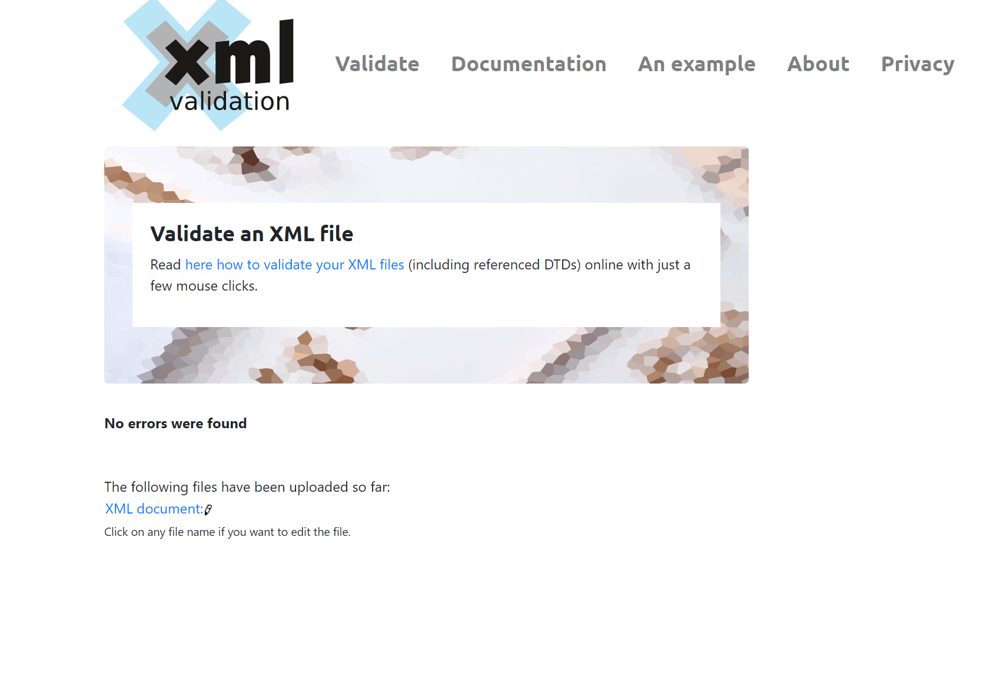

# Assignment 1

1. Open `module-2/assignments/assignment.xml` in your browser. Are there any errors? Explain the error and fix it.

1.1 error 1:There was an error here because the element was not closed and the name was not the same in the opening and closing tag.
Image:

1.2 error 2: The element needed to be originalName instead of name according to the structure of the document.
Image:

1.3 error 3: The opening and closing tags for the element were not matching.
Image:

2. What is the use of CDATA block in this document?
To write a blcok ofinformation including special characters as they are, in this way it is not recognized as language for XML In this particular case, is used in the summary element for the menu information and for the description of every item menu.
Examples:

3. Add comment line to the end of file which contains you name and student id.
Image:

4. Identify prolog, document body, and epilog in the document. Are there any processing instructions?
Considering the instructions of the assignment with the different additions and modifications, the answer is:
-Prolog: It shows the prolog at the top of the xml document as shown in the image.

-Body: It is everything inside the menuInfo element, which is the root element, that in xml there is only one.
-Epilog: It is optional, it is at the end and is the name and student ID, as shown in the image.

I did not find processing instructions, which can go in the epilog.

5. Add inline DTD for this document.
Image:

6. Verify that file is well-formed and valid.
Images:

7. Create `style.css` file and link it to the file. Add the following styles to the .css:

- Change font-size of `originalName`
- Display each `category` on the new line
- Add any other css-rule

Image:

Create `module-2/assignments/assignment_YOURNAME.md` and add your theory answers. Add screenshots of each step to the file (Refer `module-1/assignments/evaluation-1.md` on how to add image to md file)
<!--Ricardo Hornedo n01538048-->