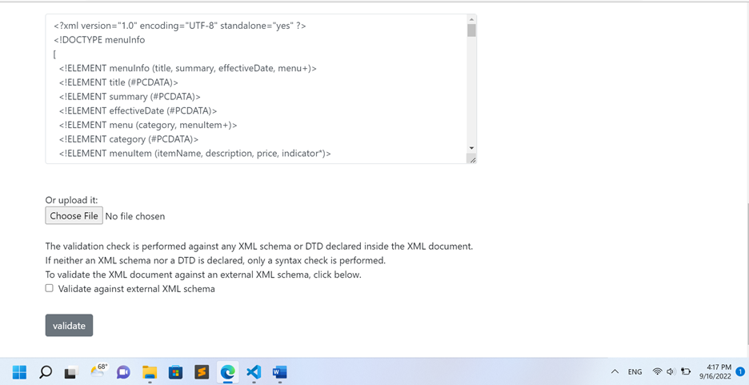

Q1- in the line 11 there is an error because of name element. if we remove the space it will be fixed.
<effectiveDate>03/12/2016</effectiveDate>
in the line 31 and 51 there are errors because the opening tag name and closing tag name mismach
xml is case sensitive
<originalName> Fresh Mornin' Sampler </originalName>
<originalName> Oatmeal Breakfast </originalName>

Q2- when we use CDATA section we can write especial characters like <>  and XML treats with them as a pure string.

Q4- 
***prolog : included XML declaration , Processing instructions , Comments lines ans DTD which are located at the begining of file
<?xml version="1.0" encoding="UTF-8" standalone="yes" ?> 
<?xml-stylesheet type="text/css" href="styleAssignment.css"?>
<!DOCTYPE menuInfo 
[
  <!ELEMENT menuInfo (title, summary, effectiveDate, menu+)>
  <!ELEMENT title (#PCDATA)>
  <!ELEMENT summary (#PCDATA)>
  <!ELEMENT effectiveDate (#PCDATA)>
  <!ELEMENT menu (category, menuItem+)>
  <!ELEMENT category (#PCDATA)>
  <!ELEMENT menuItem (itemName, description, price, indicator*)>
  <!ELEMENT description (#PCDATA)>
  <!ELEMENT price (#PCDATA)>
  <!ELEMENT indicator (#PCDATA)>
  <!ELEMENT itemName (originalName, oldName?)>
  <!ELEMENT originalName (#PCDATA)>
  <!ELEMENT oldName (#PCDATA)>
]>

***document body starts from opening root element and finish witj closing root element:
the all code between <menuInfo> .... </menuInfo> is document body.

***epilog : the last line(100) which is comment, is epilog.

***processing instructions : 
<?xml-stylesheet type="text/css" href="styleAssignment.css"?>

Q6- Screenshots:

