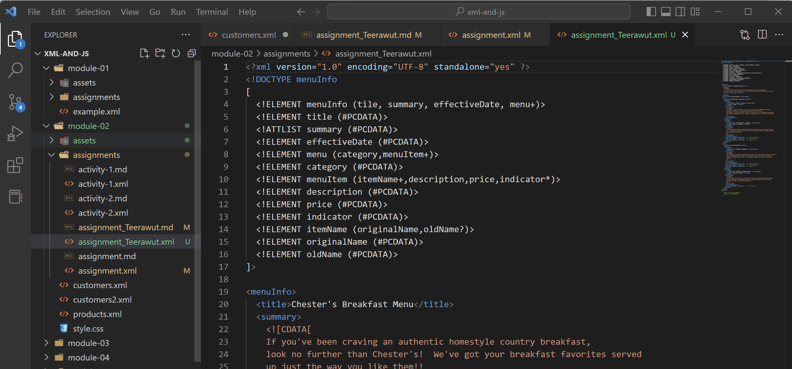

# Assignment 1

1. Open `module-2/assignments/assignment.xml` in your browser. Are there any errors? Explain the error and fix it.

There are 3 errors in line 11, 31 and 51.

Line 11: The tag name can not be a space between a tag so tag should be a single word
Line 31: The open tag and the close tag name are mismatch because xml is case senitive.
Line 51: The open tag and the close tag name are not matching. So xml tag name shoud be the same name.

--Before fixing
line 11: <effective Date>03/12/2016</effective Date>
line 31: <originalName> Fresh Mornin' Sampler </originalname>
line 51: <name> Oatmeal Breakfast </originalName>
--After fixing
line 11: <effectiveDate>03/12/2016</effectiveDate>
line 31: <originalName> Fresh Mornin' Sampler </originalName>
line 51: <originalName> Oatmeal Breakfast </originalName>

2. What is the use of CDATA block in this document?

The CDATA block is used to tell the processor that this is character data only and any special characters are skipped. So we can put anything here. 

3. Add comment line to the end of file which contains you name and student id.

<!--
    Name: Teerawut Sangpueng
    Id: N01547659
-->

4. Identify prolog, document body, and epilog in the document. Are there any processing instructions?

- Prolog is a piece of essential information written at the beginning of an XML document.
    for example
        XML delaration : <?xml version="1.0" encoding="UTF-8" standalone="yes" ?>
        Processing Instructions : <?xml-stylesheet type="text/css" href="style.css"?>
    In file assignment.xml here is not contain any processing instruction.

- The document body is a part of the xml document which can have various names and is processed under the tags for example XML elements, attributes, entities and DTD declaration.

- Epilog is optional and the last section of an XML document. This section contains XML document comments, processing instructions, or spaces.

5. Add inline DTD for this document.

6. Verify that file is well-formed and valid.

7. Create `style.css` file and link it to the file. Add the following styles to the .css:

- Change font-size of `originalName`
- Display each `category` on the new line
- Add any other css-rule

Display the result file assignment_Teerawut.xml

Create `module-2/assignments/assignment_YOURNAME.md` and add your theory answers. Add screenshots of each step to the file (Refer `module-1/assignments/evaluation-1.md` on how to add image to md file)

