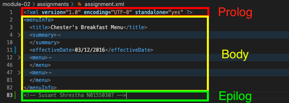

# Assignment 1

1. Tags cannot have spaces in them. \<effective Date\> -> \<effectiveDate\> 
    Open and closing tags must be the same, case sensitive. \</originalname\> -> \</originalName\>, \<name\> -> \<originalName\> 
     
    
2. CDATA block is used to interpret all characters within it literally and do not take into account any possible special meanings of them.
3.  
4. Prolog: 
     
    Body: 
     
    Epilog: 
     
    There are no processing instructions.
5.  
6.  
7.  
     