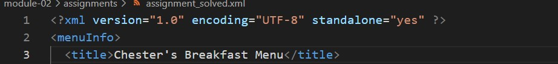

# Assignment 1(Vimal Radadiya)

1. Open `module-2/assignments/assignment.xml` in your browser. Are there any errors? Explain the error and fix it.
-Ans: 
->There are three errors.There is space between effective and Date in effectiveData tag. In second error,there is small n in closing tag of originalName and in third error there is error of tag originalName. I fixed the errors in assignment_solved.xml file.
<!-- images -->

2. What is the use of CDATA block in this document?
->Ans:In the document CDATA block is use for group of text specifying mark-up like characters. A piece of an XML document is marked with a CDATA section so that the XML parser only understands it as character data and not as markup.

3. Add comment line to the end of file which contains you name and student id.
->Ans: Done in assignment_solved.xml file.
<!-- image -->

4. Identify prolog, document body, and epilog in the document. Are there any processing instructions?
-Ans: 
->In the document it contains prolog with only xml declaration.
->the document contains document body with root element menuInfo tag
->the document does not contains epilog.
->The document contains processing instructions (<?xml-stylesheet type="text/css" href="style.css"?>) 
<!-- image -->

5. Add inline DTD for this document.
->Ans: Done is assignment_solved.xml file
<!-- image -->

6. Verify that file is well-formed and valid.
->Ans: yes the file is well formed and valid
<!-- image -->

7. Create `style.css` file and link it to the file. Add the following styles to the .css:
- Change font-size of `originalName`
- Display each `category` on the new line
- Add any other css-rule
->Ans:Done in style.css file
<!-- image -->

