# Assignment - Module

1. Open `module-2/assignments/assignment.xml` in your browser. Are there any errors? Explain the error and fix it.

- **Error#01**

  - **Error**:  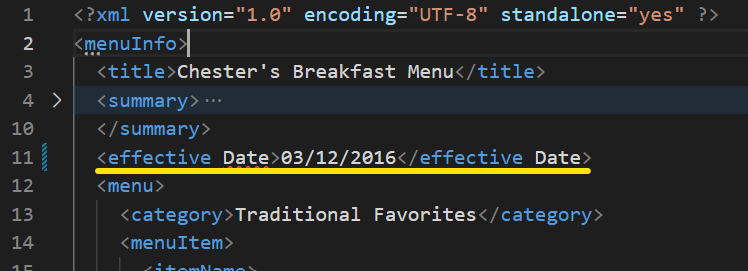
  - **Cause** : Element name`<effective Date>` contains blank space.
  - **Fix**:  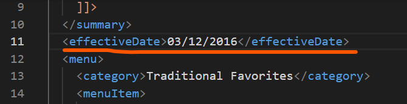

- **Error#02**

  - **Error**:  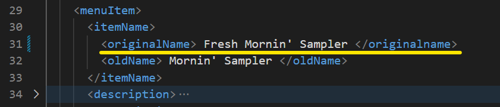
  - **Cause** : The opening tag`<originalName>` mismatches the closing tag `<originalname>`.
  - **Fix**:  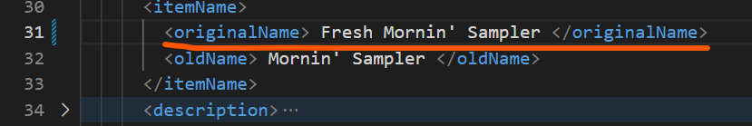

- **Error#03**

  - **Error**:  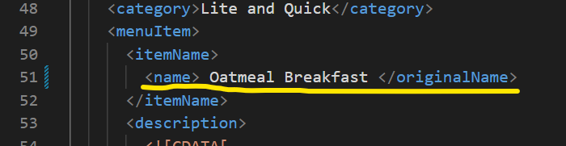
  - **Cause** : The opening tag`<name>` mismatches the closing tag `<originalName>`.
  - **Fix**:  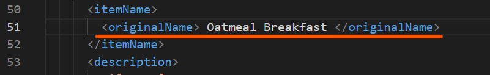

- Display in browser after fixing: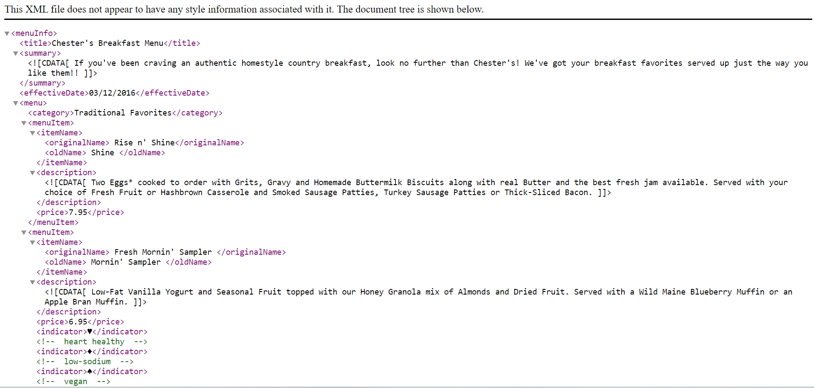

---

2. What is the use of CDATA block in this document?

- The `CDATA` block is used in `
` and `<description>` tags that might contain a bunch of character data, including the reserved symbols like `'` or `&`. Thus, the purpose of the `CDATA` block employed in this document is to keep the whole block of data intact.

---

3. Add comment line to the end of file which contains you name and student id.

- A comment `<!-- Name: Wenhao Fang; ID: n01555914 -->`has been added to the end of the file.
  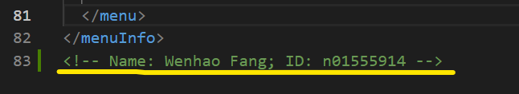

---

4. Identify prolog, document body, and epilog in the document. Are there any processing instructions?

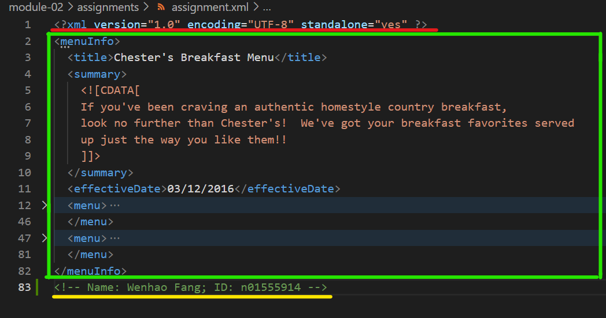

- **prolog**: XML declaration in the first line of the document. `<?xml version="1.0" encoding="UTF-8" standalone="yes"?>`. (The part underlined in red)

- **document body**: the elements in a hierarchical tree structure between the `<menuInfo>` tag and `</menuInfo>`.(The part in the green rectangle)

- **epilog**: the comment added at the end of the file `<!-- Name: Wenhao Fang, Student ID: n01555914 -->`.(The part underlined in yellow)

- The document contains no processing instruction.

---

5. Add inline DTD for this document.

- 1. Before adding the DTD, the architecture of this document has been reorganized. In particular, attributes will be added to the elements of name and indicator.
     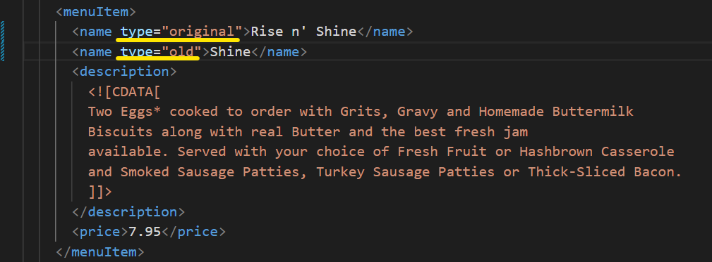
     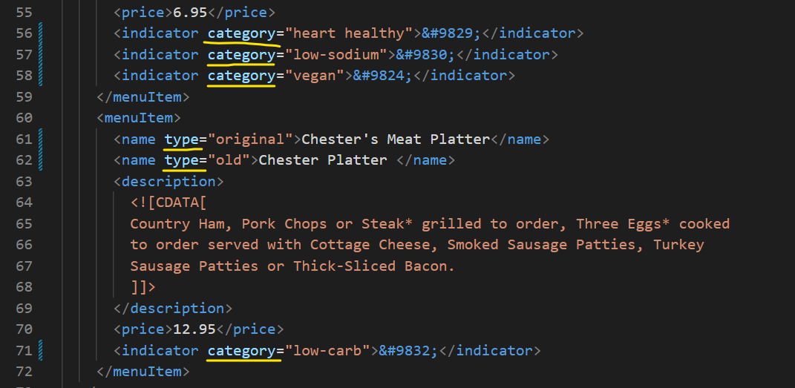

- 2. Creates a sketch accordingly:
     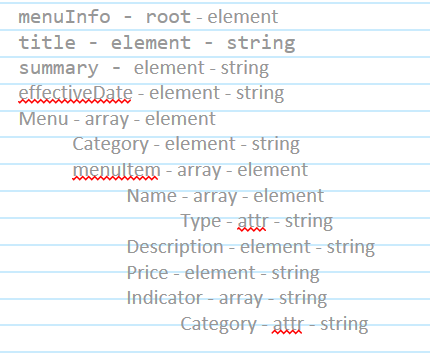

- 3. Adds DTD:
     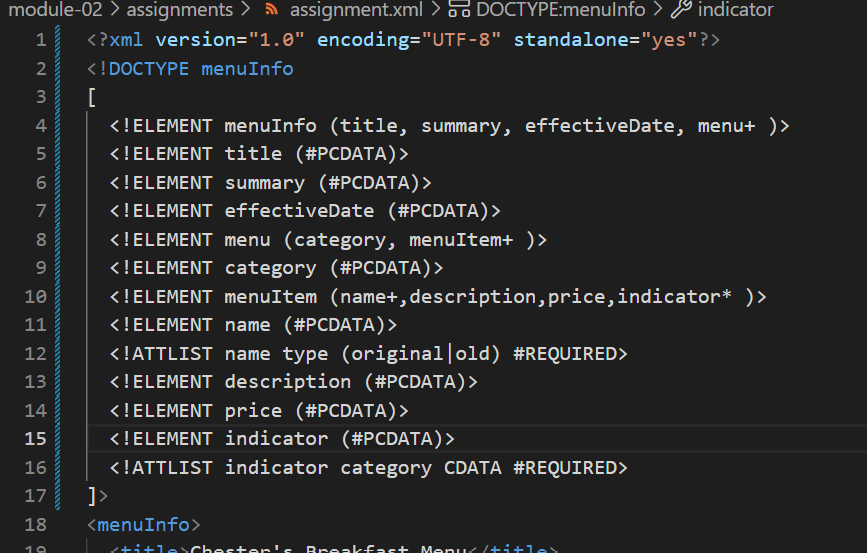

---

6. Verify that file is well-formed and valid.

- **Code**: 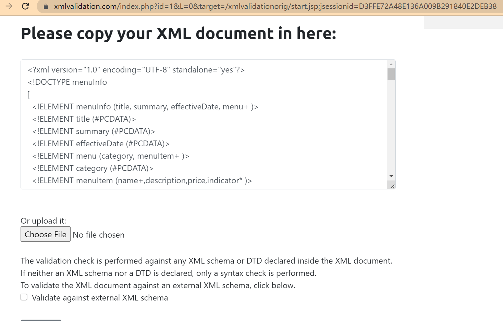

- **Result**: 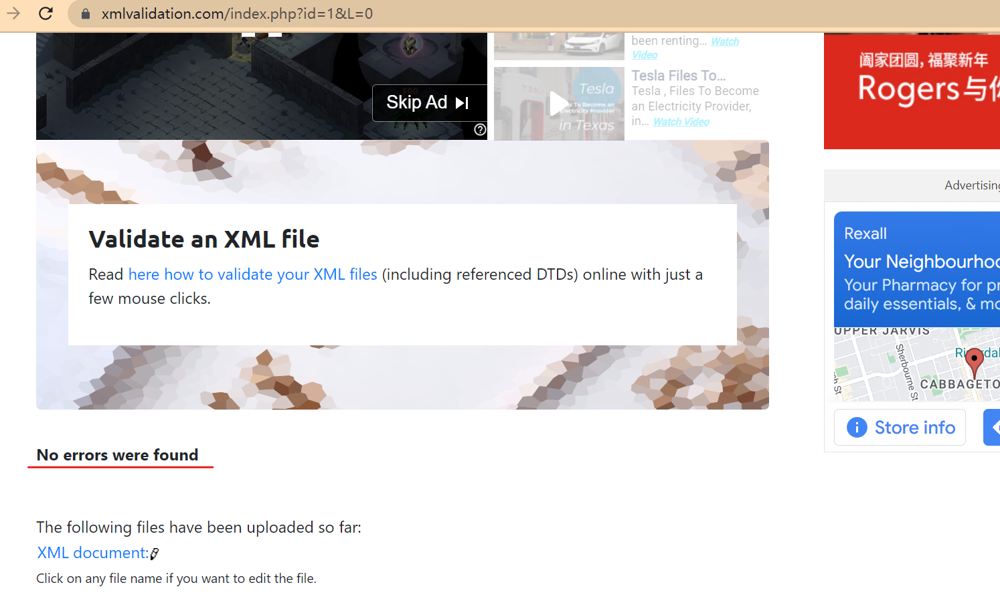

7. Create `style.css` file and link it to the file. Add the following styles to the .css:

- Css codes: 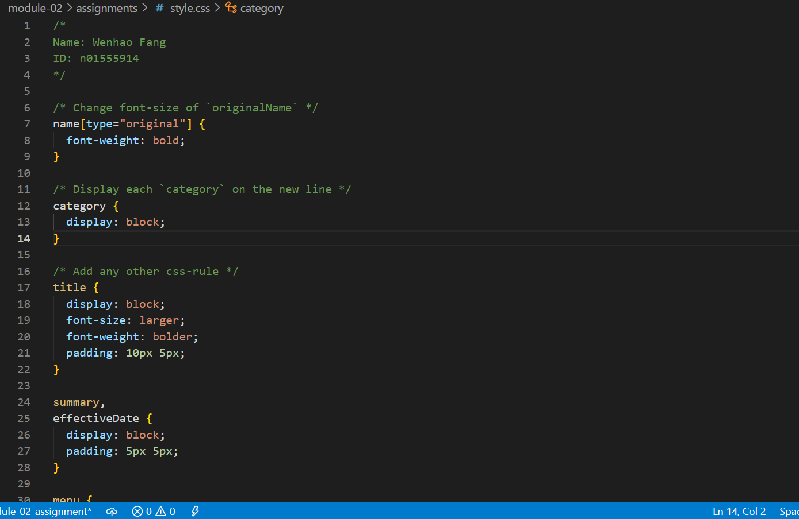

- Display in browser: 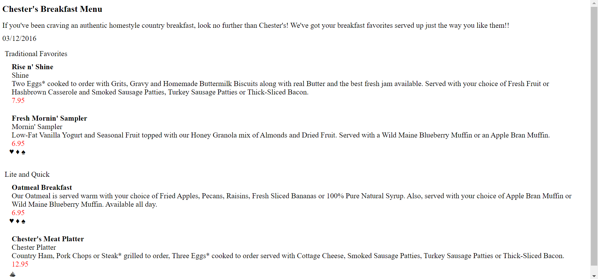
