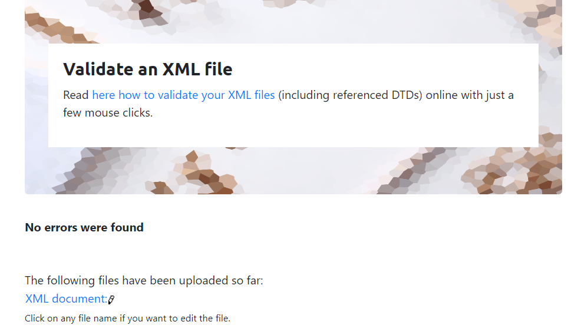

# Assignment 1

1. Open `module-2/assignments/assignment.xml` in your browser. Are there any errors? Explain the error and fix it.

Answer - There are 3 errors which i found while validating the file.one of the tag <effective date> had space in between. Another tag had different casing and the last error was about different tag names. So i remove the space in btw the tag .For 2nd error i fixed it by matching the case of both tags and the last error was resolved by typing the same tag name in both open and closing tags.

2. What is the use of CDATA block in this document?

Answer - The CDATA block is used to describe the food provided by the restaurants and also providing the overview how dishes are prepared and server in the restaurants. 

3. Add comment line to the end of file which contains you name and student id.

4. Identify prolog, document body, and epilog in the document. Are there any processing instructions?

5. Add inline DTD for this document.

6. Verify that file is well-formed and valid.

7. Create `style.css` file and link it to the file. Add the following styles to the .css:

- Change font-size of `originalName`
- Display each `category` on the new line
- Add any other css-rule

Create `module-2/assignments/assignment_YOURNAME.md` and add your theory answers. Add screenshots of each step to the file (Refer `module-1/assignments/evaluation-1.md` on how to add image to md file)
