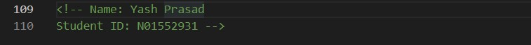
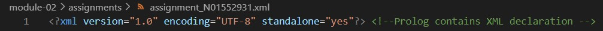
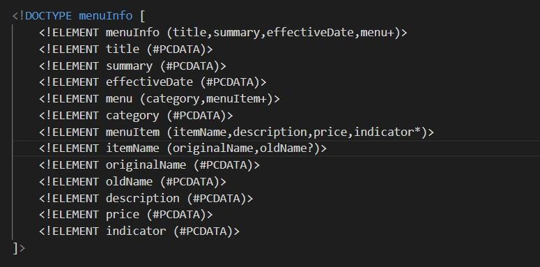
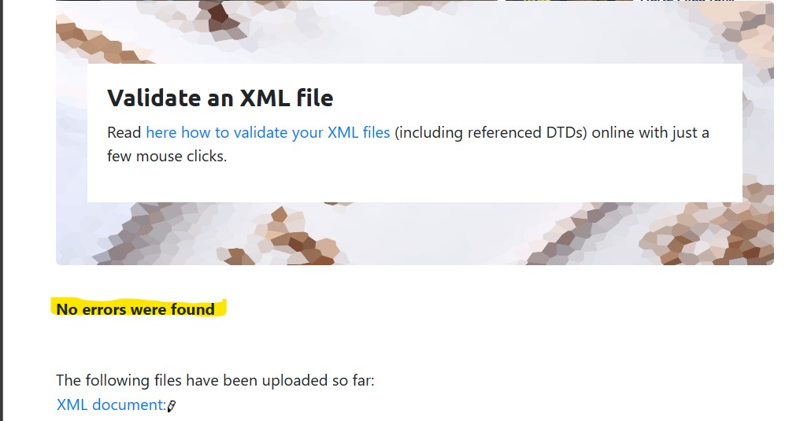
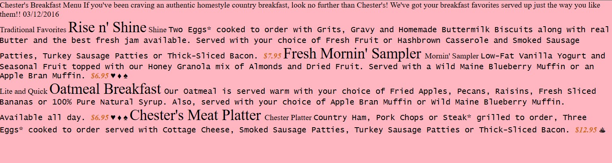

1. Open `module-2/assignments/assignment.xml` in your browser. Are there any errors? Explain the error and fix it.

    I have created an assignment file named assignment_N01552931 where I solved the errors.
    
2. What is the use of CDATA block in this document?
    CDATA stands for Character Data and it denotes that the information between these strings contains information that could be mistaken for XML markup but shouldn't be. The comma "," a specific entity in the description of items on the menu and what additional items are served with different items, is placed in this document's CDATA block. 
       
3. Add comment line to the end of file which contains your name and student id.
    

4. Identify prolog, document body, and epilog in the document. Are there any processing instructions?

    It only contains the prolog, the declaration part, which is a declaration of XML.
        

    It contains a document body and it starts from the menuInfo(<menuInfo>) tag.
    It doesn't contain an epilog.
    No, it doesn't contain any processing instructions (we add external CSS file as its required in Question 7 of assignment)

5. Add inline DTD for this document.
    

6. Verify that file is well-formed and valid.
    

7. Create `style.css` file and link it to the file. Add the following styles to the .css:

    - Change font-size of `originalName`
    - Display each `category` on the new line
    - Add any other css-rule
        