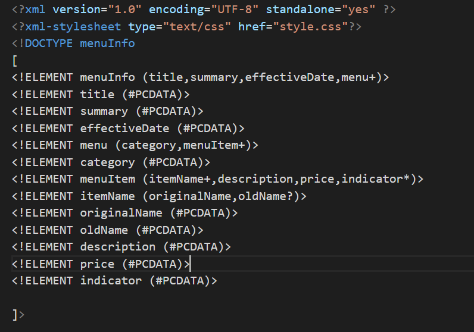
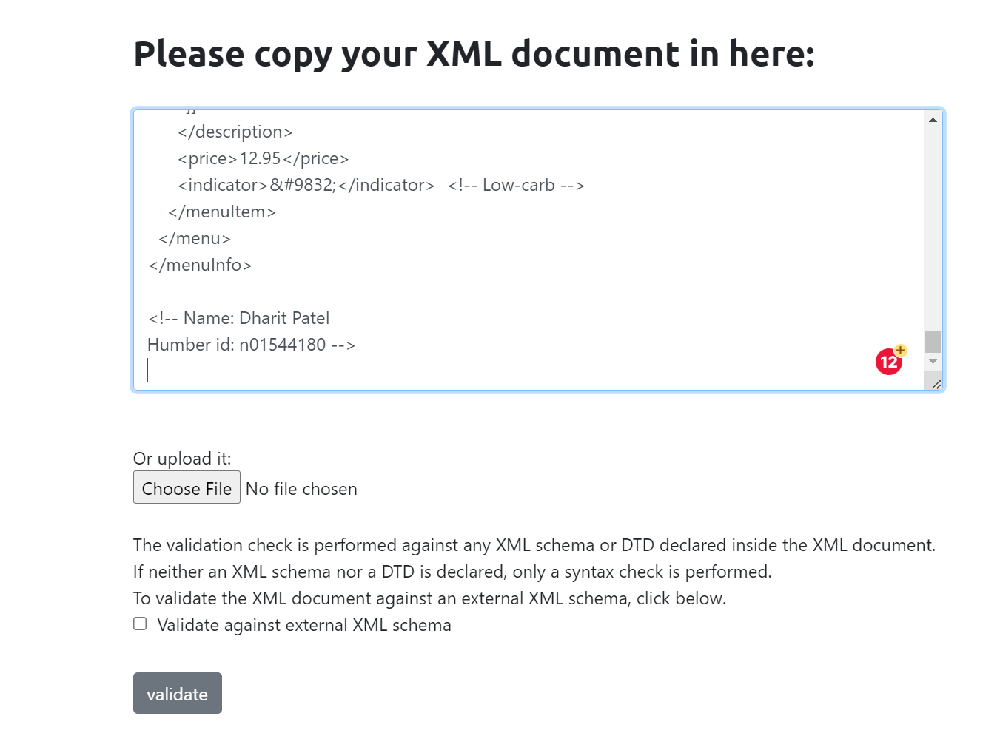
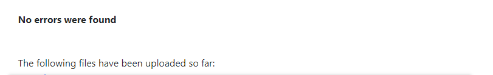

# question 1
-on line 11, the xml tag should not contain any space , so the '<effective Date>' tag should be <effectiveDate> to make sense as it contain a date

-on line 31, the opening and closing tag should be same and it should follow camel case convention, so the closing </originalname > should be same as its opening tag that is </originalName>

-on line 51, as I said earlier the opening and closing tag should be similar, so the <name> tag should be <originalName>

# question 2

CDATA stands for character data, it indicated that the data inside of it should be treated as XML markup. It is useful when we want to omit loads of special character. In this document, it is used to take the string inside the summary tag and print the string as it is.

# question 4

prolog: Any declaration before document's root element treated as prolog.

document body: The doument body contains of all the tags inside the single root element. In this case, the document body is <menuInfo>..</menuInfo>

This document does not contain any epilog.

The is one processing instructions in this document which is the xml declaration to include 'style.css'

# question 5

# question 6 
