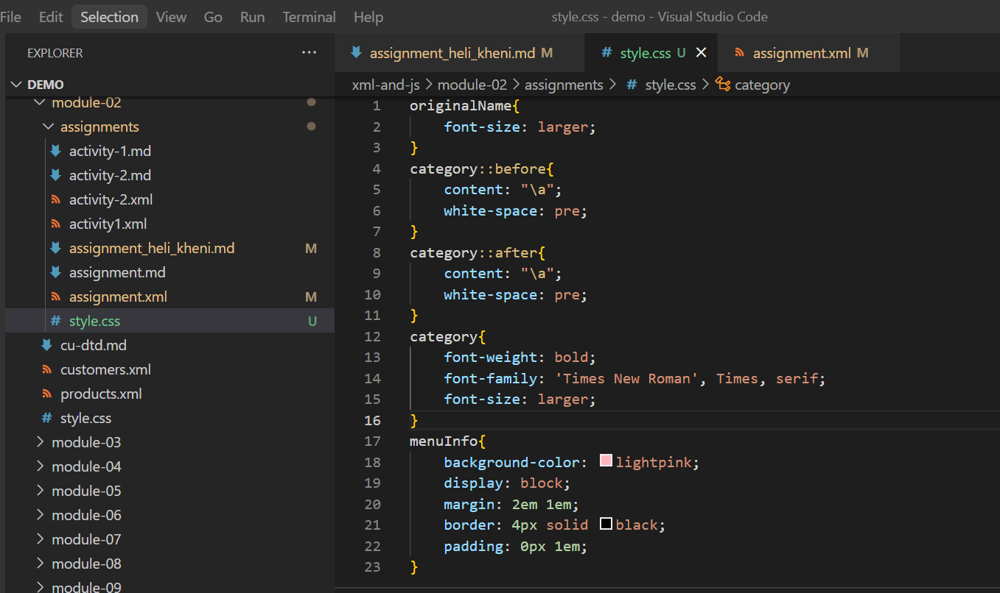
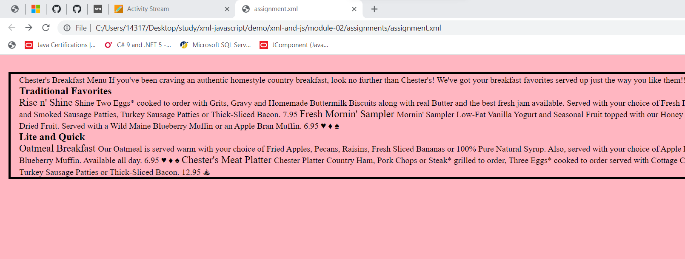

# Assignment 1

1. Open `module-2/assignments/assignment.xml` in your browser. Are there any errors? 
Explain the error and fix it.
Ans. 

ERROR1:
line11- Here the error is of space. it can't allow space in tag name. It can allow special characters like - or _ in tage names.
 wronge : <effective Date>03/12/2016</effective Date>
 correct : <effective-Date>03/12/2016</effective-Date>

ERROR2:
line 31- Here, error is mismatch start tag and end tag. In this code ending tag originalname
must be n capital as like as start tag originalName.
Error: <originalName> Fresh Mornin' Sampler </originalname>
Correct: <originalName> Fresh Mornin' Sampler </originalName>

ERROR3: 
line 51 - here, error is mismatch starting tag and ending tag. In this code line 51 has starting tag name and ending tag original name. so both must be same.
Error: <name> Oatmeal Breakfast </originalName>
Correct: <originalName> Oatmeal Breakfast </originalName>

2. What is the use of CDATA block in this document?
Ans. CDATA is used for displaying character and non-character data.It allows special symbols.
here, first CDATA is used for storing summery of menu. then all CDATA tag in menuItem class is used for discribing item information.

3. Add comment line to the end of file which contains you name and student id.
Ans. In xml, comment starts with (<!--) and end with  this (-->). I added this lines in the end of file assignment1.xml.
<!-- 
  name : Heli Kheni
  student nu : N01530895 
-->

4. Identify prolog, document body, and epilog in the document. Are there any processing instructions?
Ans.
  prolog  - line 1-2
      line 1 is xml declaration which is part of prolog. we dont't have any dtd tags or processing instructions till now, otherwise that is also part of prolog.
  document body
    line 2 to 83 - every tags and subtags and all content are document body after prolog.
    Here root element is menuInfo so menuInfo tag and under this tag all content and tags are body of xml document.
  epilog
    last 4 line comment at the end of file - which contain my name and student number.
  processing instructions
    - till now there is no processing instructions. But if we add css file line in prolog then it is processing instructions.

5. Add inline DTD for this document.
<!DOCTYPE menuInfo
[
  <!ELEMENT menuInfo (title, summary, effective-Date, menu+)>
  <!ELEMENT title (#PCDATA)>
  <!ELEMENT summary (#PCDATA)>
  <!ELEMENT effective-Date (#PCDATA)>
  <!ELEMENT menu (category, menuItem+)>
  <!ELEMENT category (#PCDATA)>
  <!ELEMENT menuItem (itemName, description, price, indicator*)>
  <!ELEMENT itemName (originalName, oldName?)>
  <!ELEMENT originalName (#PCDATA)>
  <!ELEMENT oldName (#PCDATA)>
  <!ELEMENT description (#PCDATA)>
  <!ELEMENT price (#PCDATA)>
  <!ELEMENT indicator (#PCDATA)>
]>

6. Verify that file is well-formed and valid.
ans. yes it verified. screnshots are added.

7. Create `style.css` file and link it to the file. Add the following styles to the .css:

- Change font-size of `originalName`
- Display each `category` on the new line
- Add any other css-rule

ANS. 
<?xml-stylesheet type="text/css" href="style.css"?>
- with ths use of this line I added css file to xml file.
styles are in file style.css
style file- assignments/style.css

