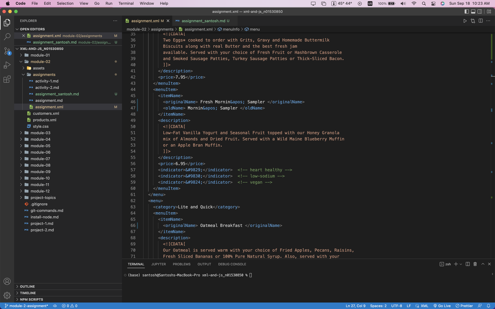
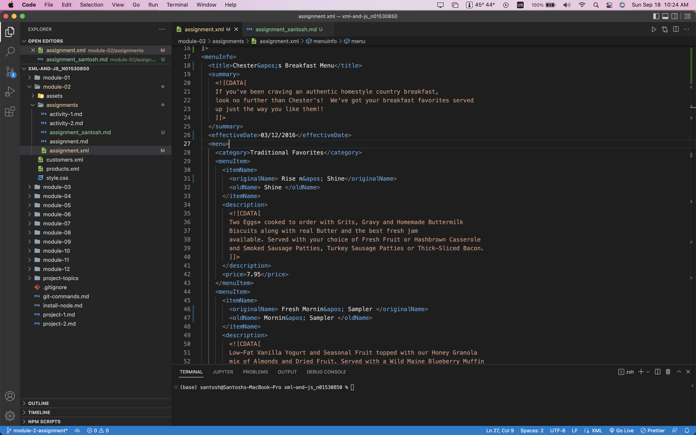

# Assignment 1

1. Open `module-2/assignments/assignment.xml` in your browser. Are there any errors? Explain the error and fix it.   
```
<effective Date>03/12/2016</effective Date> => Element name cannot contain blank space. Removed space   
<name> Oatmeal Breakfast </originalName> => Matched first tag name with end tag   
<originalName> Fresh Mornin' Sampler </originalname> => tag name mismatch. Fixed by capitalizing the 'n' in name.   
Replaced with ' => &apos;
```



2. What is the use of CDATA block in this document?   
In CDATA block, character data and special symbols like apostrophe is not parsed and the whole block is treated as string. 

3. Add comment line to the end of file which contains you name and student id.


4. Identify prolog, document body, and epilog in the document. Are there any processing instructions?   
The document's prolog is the first part of the xml document. In this document the prolog includes XML declaration only. A DTD declaration is also part of the prolog. There is no processing instruction at this point but a xml-stylesheet processing instruction will be added in the future.   
Document body includes the root. The 'menuInfo' root is the document body.   
Epilog is the last part of the document after the body. The comment at the end is the epilog.

5. Add inline DTD for this document.


6. Verify that file is well-formed and valid.


7. Create `style.css` file and link it to the file. Add the following styles to the .css:

- Change font-size of `originalName`
- Display each `category` on the new line
- Add any other css-rule


Create `module-2/assignments/assignment_YOURNAME.md` and add your theory answers. Add screenshots of each step to the file (Refer `module-1/assignments/evaluation-1.md` on how to add image to md file)


