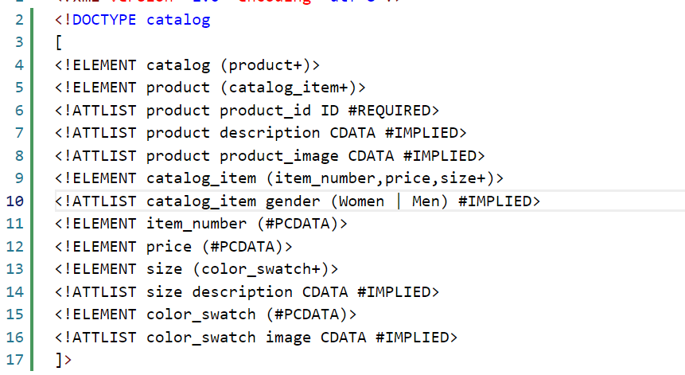
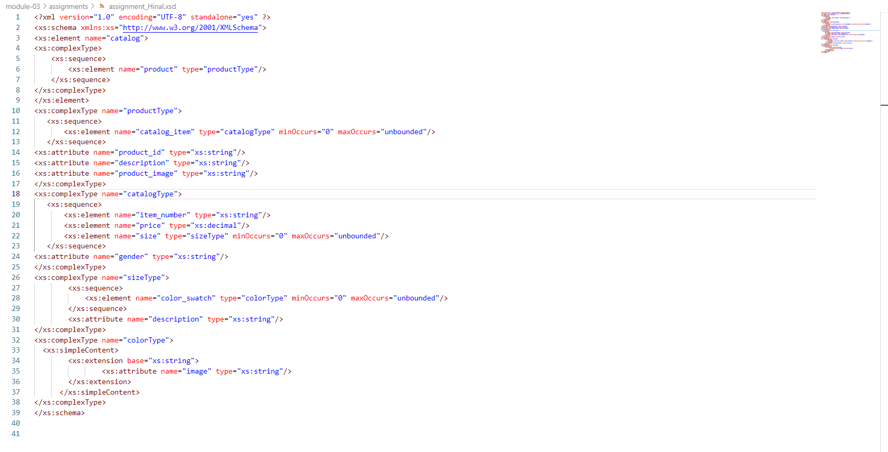
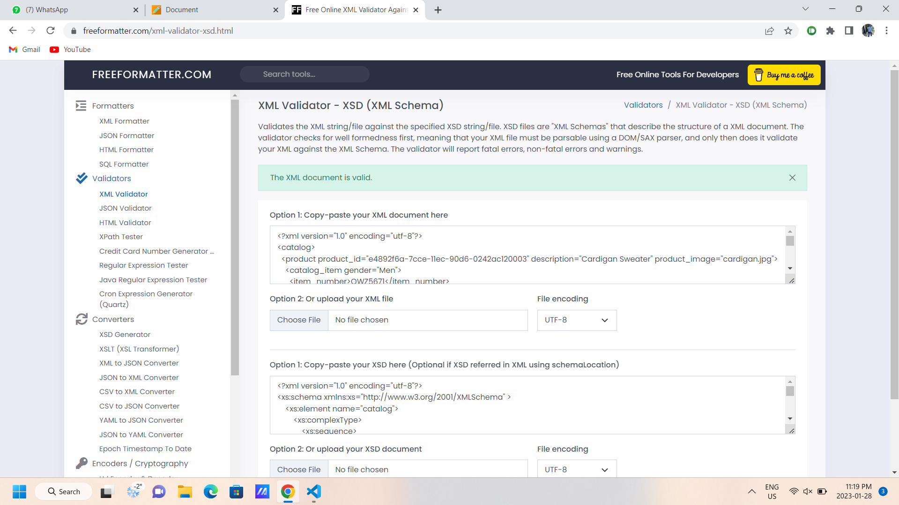

#Name: Hinal Amin
#ID: n01530824

Question:Create DTD for this file and validate it using any of the tools we used

Question:Create XSD for this file and validate it using any of the tools we used

Question:Explain your thought process for these 2 declarations

- [x] XSD(XML schemas) and DTD both are used to define the structure of an XML. However, XSD describes structure more in detail than the DTD.
- [x] In XSD, we have more datatype options than DTD.
- [x] In XSD, we can validate text elements using built-in or user- defined datatype as XSD is created using XML.
- [x] DTD does not recognize namespaces so if we have complex datatypes then we can not define all of them and for that we can use XSD as XSD supports namespaces.