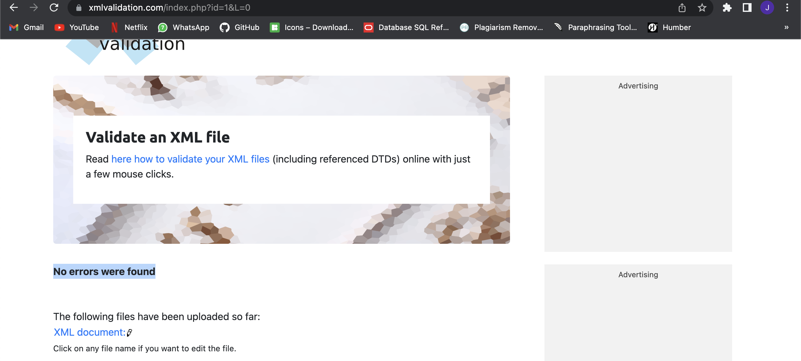
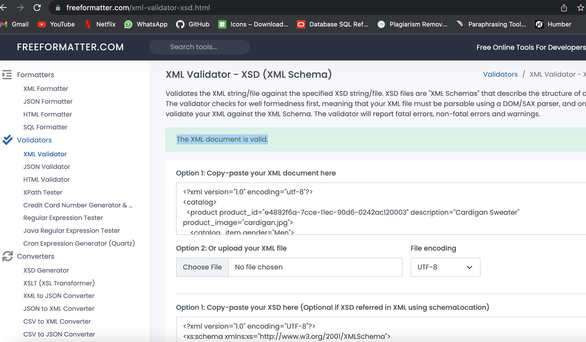

# Assignment

1. Open `module-3/assignments/assignment.xml` in your editor

2. Create DTD for this file and validate it using any of the tools we used
# DTD Validate Image: 

3. Create XSD for this file and validate it using any of the tools we used
# XSD Validate Image: 

4. Explain your thought process for these 2 declarations
- In DTD declarations we have first identify root element and then attributes of each element.
In last we have to validate using online tools to make sure dtd is validate.
- In xsd we have to use complex type and group of elements and relationship between element and attribute
Also we can add some constraints with data type. At last we validate xsd document.
- In terms of redability, XSD document is more easy compare to DTD.
- (Hard to remember DTD syntax)