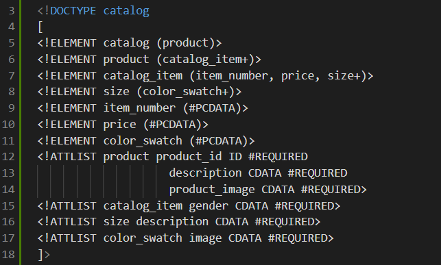
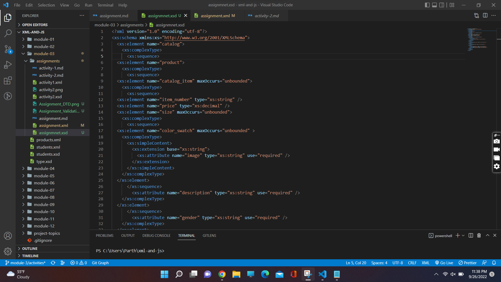
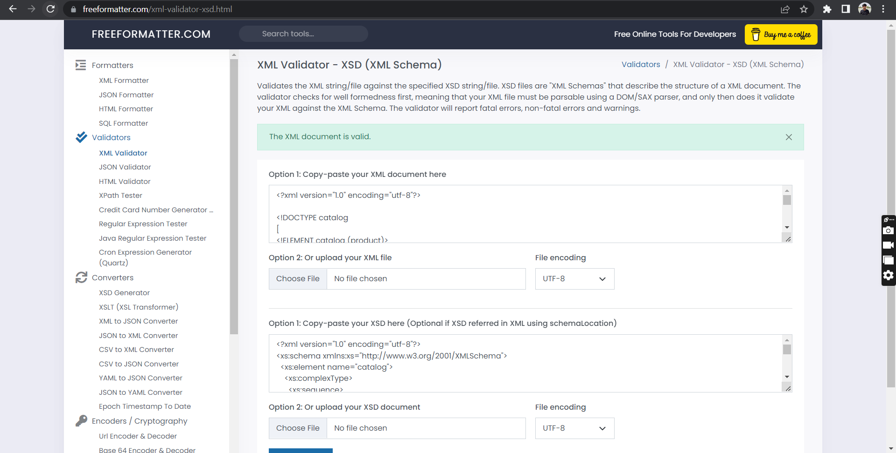

# Assignment

1. Open `module-3/assignments/assignment.xml` in your editor
2. Create DTD for this file and validate it using any of the tools we used

3. Create XSD for this file and validate it using any of the tools we used

4.Files Validation

5. Explain your thought process for these 2 declarations
XSD is easy to understand. As it is easy to read now any one seeing the code for the first time.

Create `module-3/assignments/assignment_YOURNAME.md` and add your theory answers. Add screenshots of each step to the file.
