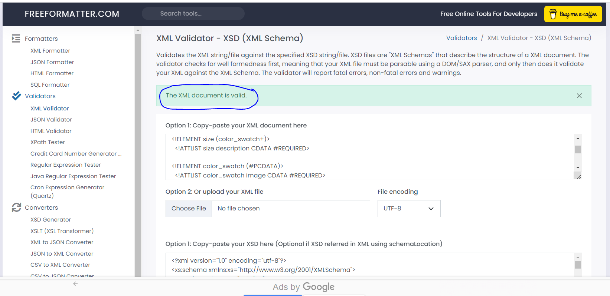
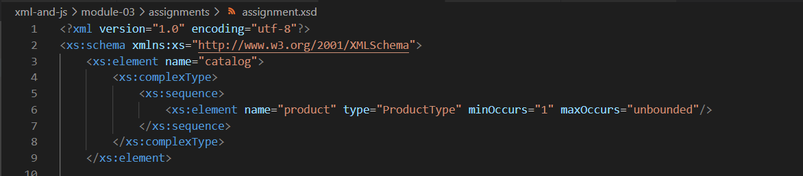
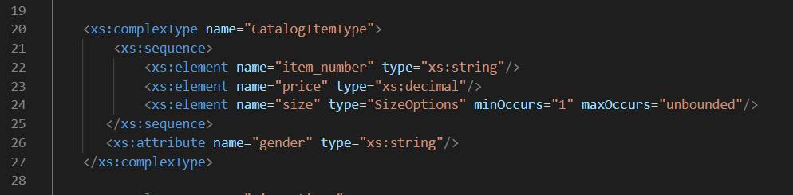

**RYAN GONZALES**
**N01540575**

Create DTD for this file and validate it using any of the tools we used. Explain your thought process.


```htm
<!DOCTYPE catalog 
[
<!ELEMENT catalog (product+)>

<!ELEMENT product (catalog_item+)>
  <!ATTLIST product product_id ID #REQUIRED>
  <!ATTLIST product description CDATA #REQUIRED>
  <!ATTLIST product product_image CDATA #REQUIRED> 

<!ELEMENT catalog_item (item_number, price, size+)>
  <!ATTLIST catalog_item gender CDATA #REQUIRED>

<!ELEMENT item_number (#PCDATA)>
<!ELEMENT price (#PCDATA)>
<!ELEMENT size (color_swatch+)>
  <!ATTLIST size description CDATA #REQUIRED>

<!ELEMENT color_swatch (#PCDATA)>
  <!ATTLIST color_swatch image CDATA #REQUIRED>
]>
```



**For my DTD, I named the DOCTYPE as "catalog", which is the root element of the xml file. In the next populated line, I defined the parent element "catalog", with the child element "product". The plus sign beside the child element indicates cardinality, where least one element can exist in the content model of the xml.**

**In the next populated line, I defined "product" as the next parent element with child element "catalog_item". The plus sign beside the child element indicates cardinality, where least one element can exist in the content model of the xml. The next three lines after this indicates the attributes assigned to the "product" element. First attribute is "product_id", in which I indicated it is "ID" attribute type as it seems to be a unique identifier of a product. Second and third attributes are "description" and "product_image" respectively, in which I indicated both to have "CDATA" attribute type since they contain string values. All (for example, these are data specifications for an online catalog where product_id, description and product_image will allow clients to see important details of the item) that will define what the product is all about.**

**In the next populated lines, I defined "catalog_item" as the next parent element with three child elements: "item_number", "price" and "size" respectively. Both "item_number" and "price" do not have cardinality indicator as this means that both are required or must be contained in sequencial order together with at least one "size" element. I made item_number and price as required since in real retail/procurement scenarios, these data are required for an item. The plus sign beside the child element "size" indicates cardinality, where least one element can exist in the content model of the xml. The next line after this indicates the attributes assigned to the "catalog_item" element. Only one attribute, "gender", is listed and I indicated that the element is of string attribute type by using CDATA attribute type beside it. It is just right to indicate the "gender" attribute as required (placed #REQUIRED beside it) as this catalog_item attribute provides additional differentiation for the product**

**In the next two populated lines, I defined the two child elements: "item_number" and "price". Since both of them contain only parsed data (no child elements assigned to them), I indicated this by adding #PCDATA. I then defined "size" in the next line as the next parent element with  chid element "color_swatch". "color_swatch" have cardinality indicator of a plus sign, where least one element can exist in the content model of the xml. In any retail/procurement scenario, at least one color of an item should be known for an item, that is why at least one "color_swatch" element must be present/defined. The next line after this indicates the attribute assigned to the "size" element. Only one attribute, "discription", is listed and I indicated that the element is of string attribute type by using CDATA attribute type beside it. The description attribute is tagged as required since this gives a client what sizes are available for a certain item or product in the catalog.**

**The last two lines defines the last child element, "color_swatch" and it's attribute "image" with CDATA attribute type (as it contains the file name of the image of the color_swatch) assigned to it. Since color_swatch only holds parsed data (no child elements assigned to them), I indicated this by adding #PCDATA. I indicated this as required since cardinality indicates at least one color_swatch must be present, then at least one color of the item can also defined and a corresponding image of the item of that color should also be present in a catalog (it will be weird if a catalog doesn't have at least one picture of the item the company is selling).**

Create XSD for this file and validate it using any of the tools we used. Explain your thought process.


```htm
<?xml version="1.0" encoding="utf-8"?>
<xs:schema xmlns:xs="http://www.w3.org/2001/XMLSchema">
    <xs:element name="catalog">
        <xs:complexType>
            <xs:sequence>
                <xs:element name="product" type="ProductType" minOccurs="1" maxOccurs="unbounded"/>
            </xs:sequence>
        </xs:complexType>
    </xs:element>

    <xs:complexType name="ProductType">
        <xs:sequence>
            <xs:element name="catalog_item" type="CatalogItemType" minOccurs="1" maxOccurs="unbounded"/>
        </xs:sequence>
        <xs:attribute name="product_id" type="xs:string"/>
        <xs:attribute name="description" type="xs:string"/>
        <xs:attribute name="product_image" type="xs:string"/>
    </xs:complexType>

    <xs:complexType name="CatalogItemType">
        <xs:sequence>
            <xs:element name="item_number" type="xs:string"/>
            <xs:element name="price" type="xs:decimal"/>
            <xs:element name="size" type="SizeOptions" minOccurs="1" maxOccurs="unbounded"/>
       </xs:sequence>
       <xs:attribute name="gender" type="xs:string"/>
    </xs:complexType>	

    <xs:complexType name="SizeOptions">
        <xs:sequence>
			<xs:element name="color_swatch"  minOccurs="1" maxOccurs="unbounded" >
				<xs:complexType>
					<xs:simpleContent>
						<xs:extension base="xs:string">
							<xs:attribute name="image" type="xs:string"/>
						</xs:extension>
					</xs:simpleContent>
				</xs:complexType>
			</xs:element>
		</xs:sequence>
        <xs:attribute name="description" type="xs:string"/>
    </xs:complexType>	

</xs:schema>
```


**First I defined the XML schema which is the same one we used in activity2. Then I defined the first element "catalog" which is a complex type since it has attributes. I also indicated a sequence below it as it has child elements assigned to it. Inside the sequence is the catalog's child element, "product". And since "product" also has child elements under it, I defined a type for this as "ProductType", which will be defined as a complex type element and will have it's own set of elements under it's sequence. And since there can be at least be one product existing in a catalog, I defined element "product" to have minOccurs="1" which means the element can appear at least once, and maxOccurs="unbounded" which means it can be more than 1 without a set limit.**


**In the next populated lines, I defined complex type element "ProductType", which came from element "product" type I defined. Here I also indicated a sequence since ProductType has the child element "catalog_item". And since "catalog_item" also has child elements under it, I defined a type for this as "CatalogItemType", which will be defined as a complex type element and will have it's own set of elements under it's sequence. And since there can be at least be one catalog_item existing in a product, I defined element "catalog_item" to have minOccurs="1" which means the element can appear at least once, and maxOccurs="unbounded" which means it can be more than 1 without a set limit. In the next three lines below the sequence ending tag, the product element's attributes in xml are defined where in "product_id", "description" and "product_image" were used as string type elements.**



**In the next populated lines, I defined complex type element "CatalogItemType", which came from element "catalog_item" type I defined. Here I also indicated a sequence since CatalogItemType has three child elements: "item_number", "price" and "size". I defined them of their data types as used in the xml, assigning "string", "decimal" and "SizeOptions" respectively.**

**And since "size" also has child elements under it, I defined a type for this as "SizeOptions", which will be defined as a complex type element and will have it's own set of elements under it's sequence. And since there can be at least be one size existing in a catalog_item, I defined element "size" to have minOccurs="1" which means the element can appear at least once, and maxOccurs="unbounded" which means it can be more than 1 without a set limit. In the next line below the sequence ending tag, the catalog_item element's attribute in xml is defined where in "gender" is used as string type element.**


**In the next populated lines, I defined complex type element "SizeOptions", which came from element "size" type I defined. Here I also indicated a sequence since SizeOptions has the child element "color_swatch". The element "color_swatch" doesn't have any child elements under it but has attributes assigned to it, I used the format of using complexType, simpleContent, then extension tags. And in the innermost is the attributes tag and I defined the attribute of the color_swatch which is "image" to be of string type (since it uses the file name of an image). And since there can be at least be one color_swatch existing in a certain size of an item/product, I defined element "color_swatch" to have minOccurs="1" which means the element can appear at least once, and maxOccurs="unbounded" which means it can be more than 1 without a set limit. In the next line below the sequence ending tag, the product element size's attribute "description" has been used as a string type element.**