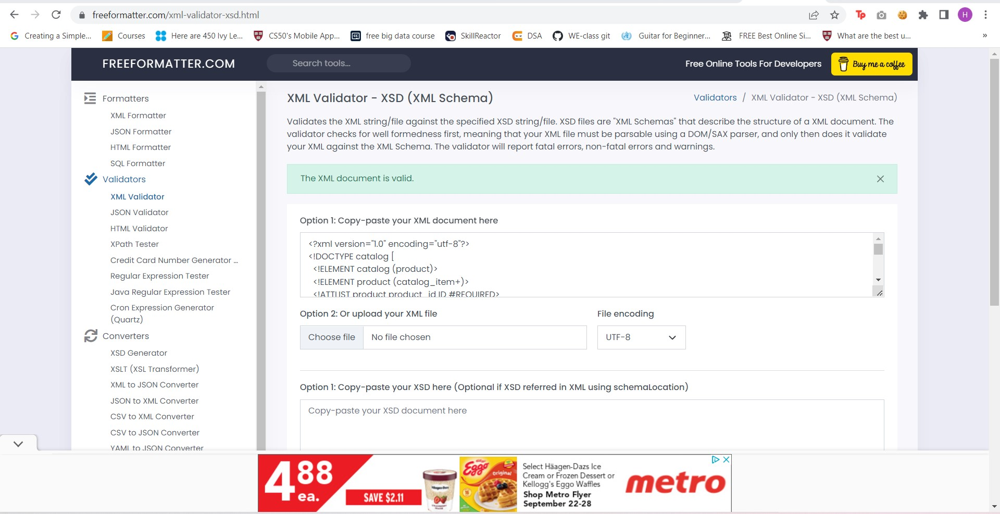
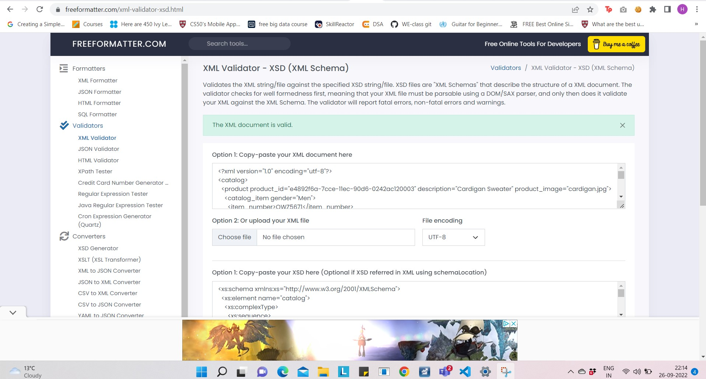

# Assignment

1. Open `module-3/assignments/assignment.xml` in your editor
2. Create DTD for this file and validate it using any of the tools we used

<!DOCTYPE catalog [
  <!ELEMENT catalog (product)>
  <!ELEMENT product (catalog_item+)>
  <!ATTLIST product product_id ID #REQUIRED>
  <!ATTLIST product description CDATA #REQUIRED>
  <!ATTLIST product product_image ENTITY #REQUIRED>
  <!ENTITY cardigan.jpg SYSTEM "cardigan.jpg" NDATA jpg>
  <!ELEMENT catalog_item (item_number,price,size+)>
  <!ATTLIST catalog_item gender (Men | Women) #REQUIRED>
  <!ELEMENT item_number (#PCDATA)>
  <!ELEMENT price (#PCDATA)>
  <!ELEMENT size (color_swatch+)>
  <!ATTLIST size description CDATA #REQUIRED>
  <!ELEMENT color_swatch (#PCDATA)>
  <!ATTLIST color_swatch image ENTITIES #REQUIRED>
  <!ENTITY red_cardigan.jpg SYSTEM "red_cardigan.jpg" NDATA jpg>
  <!ENTITY burgundy_cardigan.jpg SYSTEM "burgundy_cardigan.jpg" NDATA jpg>
  <!ENTITY navy_cardigan.jpg SYSTEM "navy_cardigan.jpg" NDATA jpg>
  <!ENTITY black_cardigan.jpg SYSTEM "black_cardigan.jpg" NDATA jpg>
  <!NOTATION jpg SYSTEM "image/jpeg">

]>

3. Create XSD for this file and validate it using any of the tools we used
<xs:schema xmlns:xs="http://www.w3.org/2001/XMLSchema">
  <xs:element name="catalog">
    <xs:complexType>
      <xs:sequence>
        <xs:element name="product">
          <xs:complexType>
            <xs:sequence>
              <xs:element name="catalog_item" minOccurs="1" maxOccurs="unbounded" >
                <xs:complexType>
                  <xs:sequence>
                    <xs:element type="xs:string" name="item_number"/>
                    <xs:element type="xs:float" name="price"/>
                    <xs:element name="size" minOccurs="1" maxOccurs="unbounded" >
                      <xs:complexType>
                        <xs:sequence>
                          <xs:element name="color_swatch" minOccurs="1" maxOccurs="unbounded" >
                            <xs:complexType>
                              <xs:simpleContent>
                                <xs:extension base="xs:string">
                                  <xs:attribute type="xs:string" name="image" use="required"/>
                                </xs:extension>
                              </xs:simpleContent>
                            </xs:complexType>
                          </xs:element>
                        </xs:sequence>
                        <xs:attribute type="xs:string" name="description" use="required"/>
                      </xs:complexType>
                    </xs:element>
                  </xs:sequence>
                  <xs:attribute type="xs:string" name="gender"/>
                </xs:complexType>
              </xs:element>
            </xs:sequence>
            <xs:attribute type="xs:string" name="product_id"/>
            <xs:attribute type="xs:string" name="description"/>
            <xs:attribute type="xs:string" name="product_image"/>
          </xs:complexType>
        </xs:element>
      </xs:sequence>
    </xs:complexType>
  </xs:element>
</xs:schema>

4. Explain your thought process for these 2 declarations

DTD:
Here we start with the root element catalogue which has just one child element product, since product occurs only once we haven't used + here.
product has catalogue_item which occurs multiple times(hence +) as its child and product ID of type ID , description which will be string and product image which we have declared as an entity since it has an image file. Next we move to catalogue item which has item_number,price and size as its child elements where size occurs multiple times. Catalogue_item has attribute gender which has values Men or women hence it is enumerated type.Next we move to itemnumber and price where both will be PCDATA and they don't have child element followed by the size which has color swatch as child element. Size has an attribute description which will be strings so we use CDATA and thsi will be required. This is followed by color_swatch element which has image as an attribute. since we are using multiple images here we declare it as entities and then provide each entitiy image followed by the notation for jpg as we are using jpg images.

XSD:
In Xsd we will be using the second method to form the xsd for this XML. We start with the root element catalogue followed by its child element product.We then go to its child element catalogue_items, this will have minoccours=1 since it comes atleast once.Then we move on to item_number and price, price is of the type float as discussed in class. Then we come to the complex type size which has color_swatch as its child, since there are multiple sizes this will also have a minoccours=1. Then we move to color_swatch which has an attribute image, since there are multiple options in color swatch this will also have min_occurs=1. For simplicity we will keep the image attribute as type string and it will be required since all the color swtach have one.Then we move back for the description attribute of size , this also occurs more than once and is required as all elements have one.Then we move out to gender attribute of the catalogue_item followed by the three attributes of product. Here also we have used string for the image for simplicity as we don't have the pictures. This is with ID type for product ID and string for description.

Referrence used for image declaration using enities: [https://www.quackit.com/xml/tutorial/dtd_embedded_images.cfm](https://www.quackit.com/xml/tutorial/dtd_embedded_images.cfm) 

Create `module-3/assignments/assignment_YOURNAME.md` and add your theory answers. Add screenshots of each step to the file.
