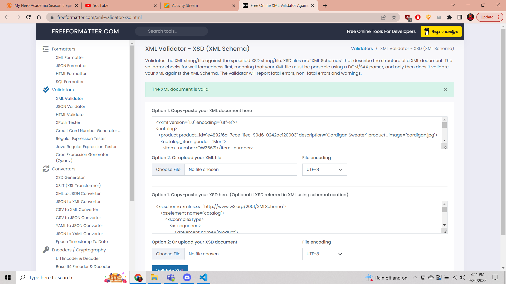

In XSD file, element catalog was of complex type with a complex type element product inside it with attributes product_id, description and product_image. Further it also includes, catalog_item element of complex type with sequence elemtns of item_number,price and complex type element size with 1 attribute as description and its sequence element as color_swatch which have an attribute image and base extension of string type.