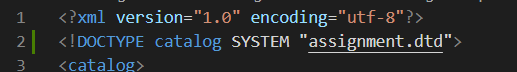
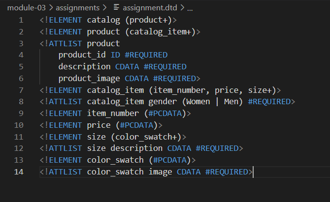
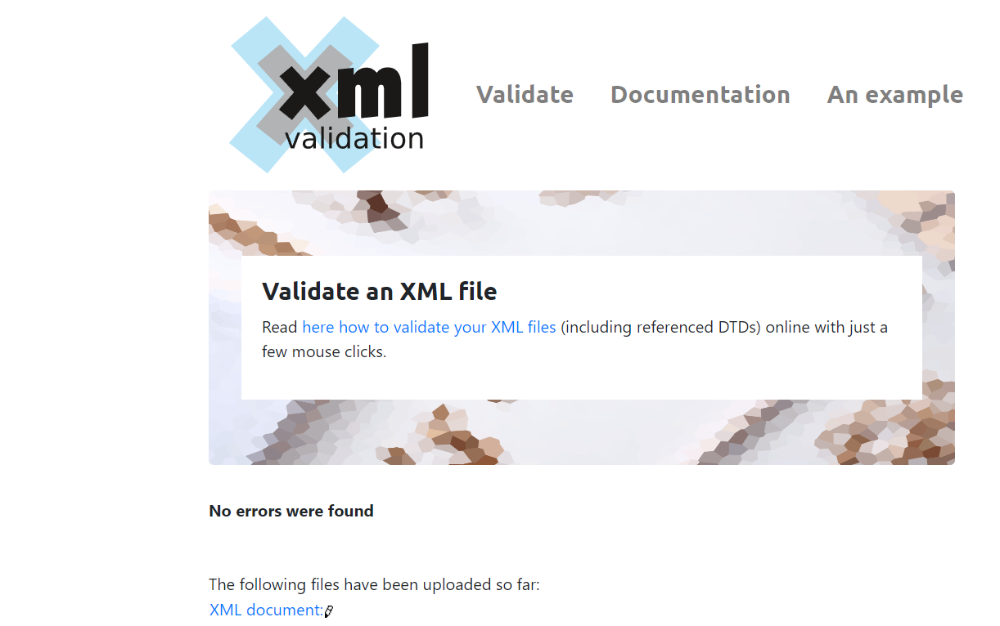
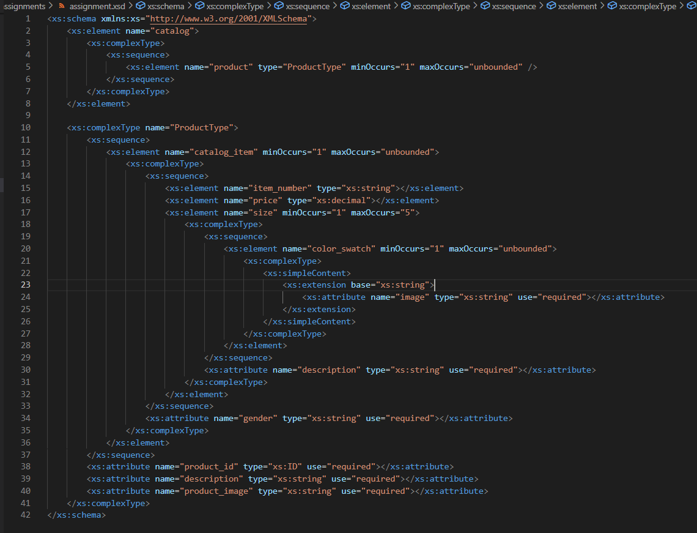
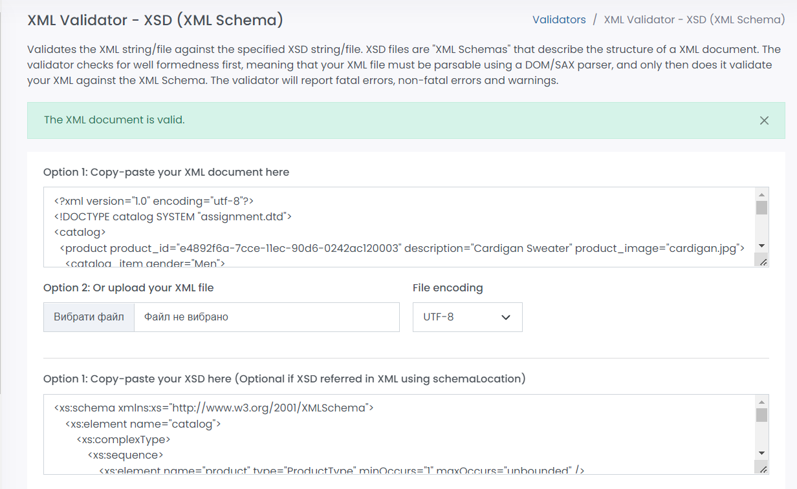

# TASK1

Create DTD for this file and validate it using any of the tools we used

1. dtd link

2. dtd file

3. validation

# TASK2

Create XSD for this file and validate it using any of the tools we used

1. xsd file

2. validation

# TASK3

1. Explain your thought process for these 2 declarations

 - DTD Algorithm:

  1. definig children of root elememt(put all cardinals where needed)

  2. definig each child children and put all cardinals where needed (do this step as many times as needed)

  3. definig each child name and type

  4. definig each element attributes with their types

 - XSD Algorithm:

  1. definig root element and the sequence of elements that are inside of root element (put number of occurences of this element).

  2. name the complex type of this element and describe this element

  3. define the element to describe it:

  4. if the element has scalar type (no sequence is there and no attributes) then just put the name and the type of the element

  5. if the element consists of differenet elements, then put type as complextype, inside there sequence, inside there describe each element (go to 3rd point/item in this XSD Algorithm)

  6. if the element has attribute and no sequence inside, then put the type as complex type, inside there simple content, inside there extansion and base of extension, and finally inside there the attribute name, type and use (required, prohibited, optional)

  7. if the element has attribute and sequence, after sequence put the attribute tag and describe inside the name and the type of the attribute

  8. if some element has more than one occurence or its optional, add min and max occurences to this element.