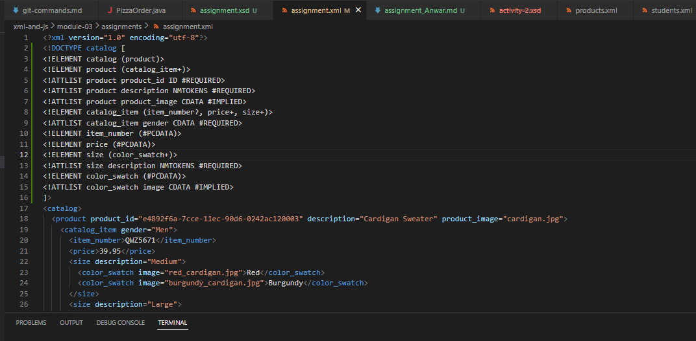
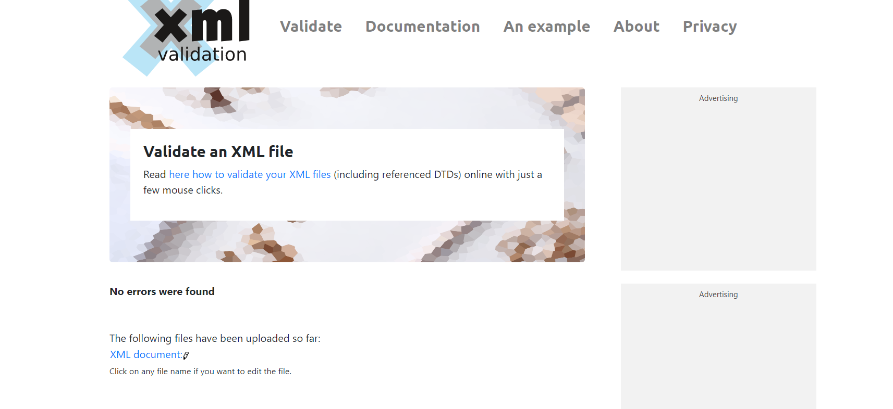
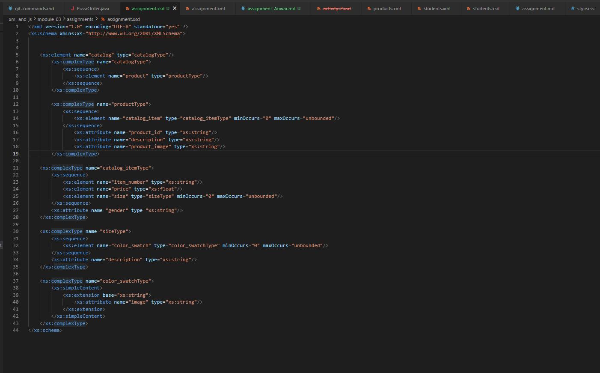
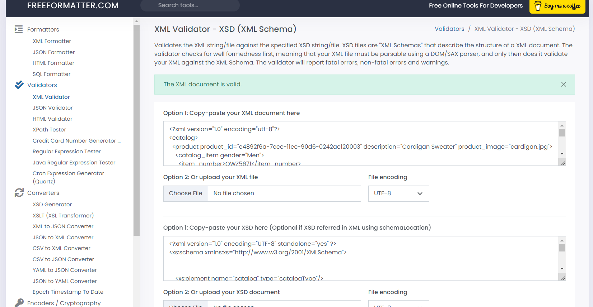

2.Ans.

3.Ans

4.Ans.

DTD is Known as Document Type Defination
XSD is known as XML schema defination 

They both are used to deifne the actual structure of an XML document but they are some differences in terms of they rules and features

DTD is the older version whereas the XSD is Recent Version with advanced options in it.
when we have variety of data types it is recommended to used XSD because it is XML based language and has more options to process, However DTD just supports basic data types 

Moreover DTD is Very Complex to understand whereas XSD is very simple to understand.

Over All XSD is more prefarable over DTD to validate the XML document as it has many features.

