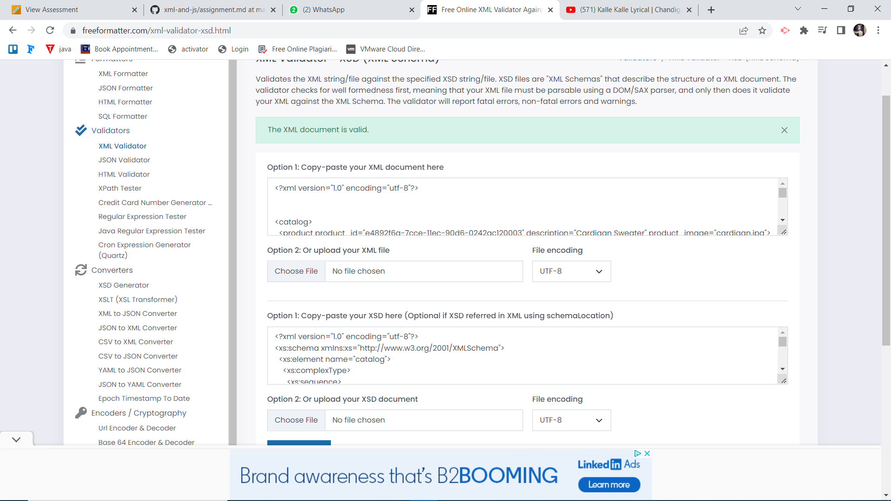

## Ans 4. While working with DTD I began with list then with has prodcut +. The + sign demonstrates that there are different components inside that specific component. Presently, the item has various characteristics which are  product_image, and product_id which are under CDATA which implies that it is only a message and won't be parsed by the parser. Labels inside the text won't be extended. After that we have catalog_item+ inside the item label which has further qualities of Orientation and is REQUIRED field. Moreover, it has different labels which are item_number, cost and size. Furthermore, later all the other things goes into progression very much like the above labels.

## I followed a similar technique as DTD by going in sequential request. It has complex sorts which contains different components. The basic substance contains no different components. It fundamentally allows you to characterize the design and information kind of the XML archive. We make a separate file for xsd 