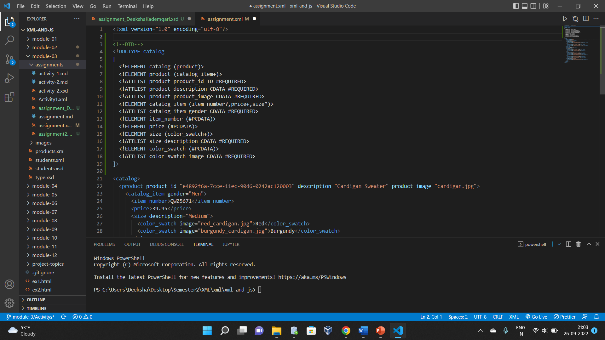
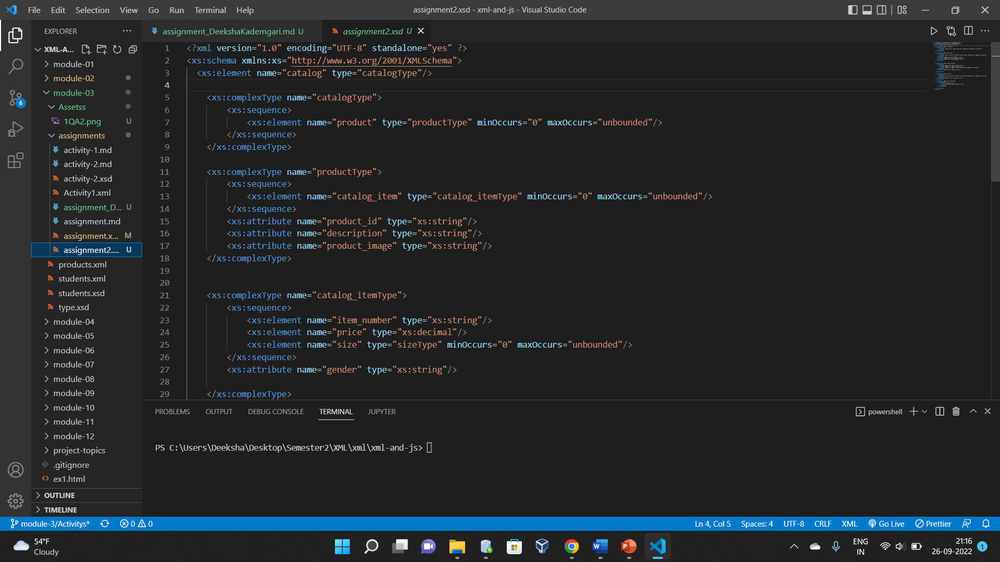

1.  DTD

2.  XSD files

3.  DTD declaration is complex, when mentioning the workflow with cardinality, attribute types if there are more tags its much more difficult to understand the flow.
    Does not contain the namespaces,

XSD is less complex when compared to DTD, need to mention the workflow of tags, the datatype and no need mention the cardinality.
Contains Namespaces which helps to easily differentiate the data which contains same tag but different content. XSD is easily learnt.
