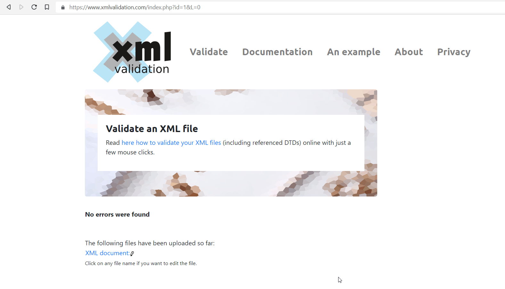

1. 

2. 

3. 

4. Thought processes:
    For DTD:
        We start in the same .xml file and start with a DOCTYPE declaration implying that the upcoming content is DTD (Document Type Definitions). We write the root-element name after DOCTYPE and also begin with the root-element in element type declarations, listing all the direct children in the braces. Then we define those children following the same process, the only difference is that some elements may contain attributes and thus we need to define them in a separate tag as well, by either listing all the attributes of one element in one ATTLIST declaration or in separate declarations. This is followed until we run out of elements and their attributes to declare.

    For XSD:
        We create a separate .xsd file and start with the xml declaration and then declare the schema and specify the URI of the resource where the structure to be used by the xml file is kept. Then we begin with the root-element declaration and then we have two options: whether to expand the element declaration tag and keep on doing this to create a big tag, or rather to create separate tags for different elements. The second method is what I used in this case and we can match the next element declaration using the type used in the previous declarations. If the element contains any children or attributes, then we need to declare it as complex type, otherwise we can declare it as a normal element having predefined type. This is also repeated till we run out of elements and their attributes to declare.