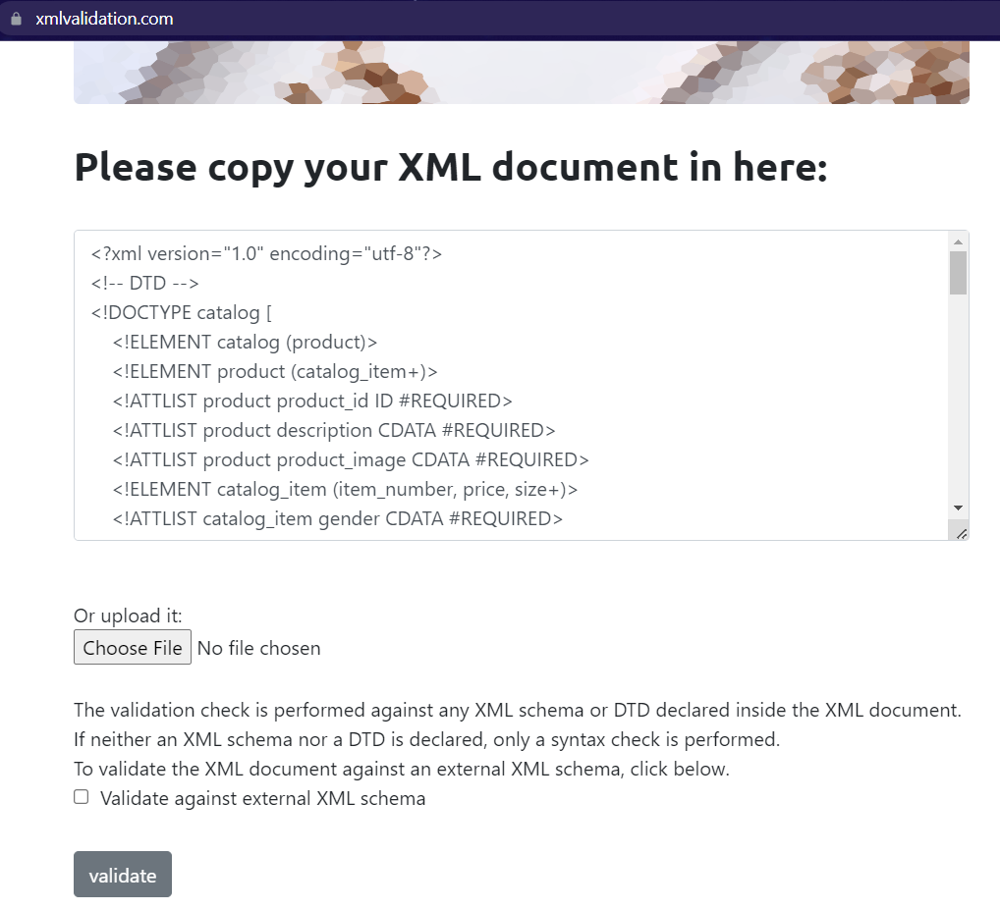
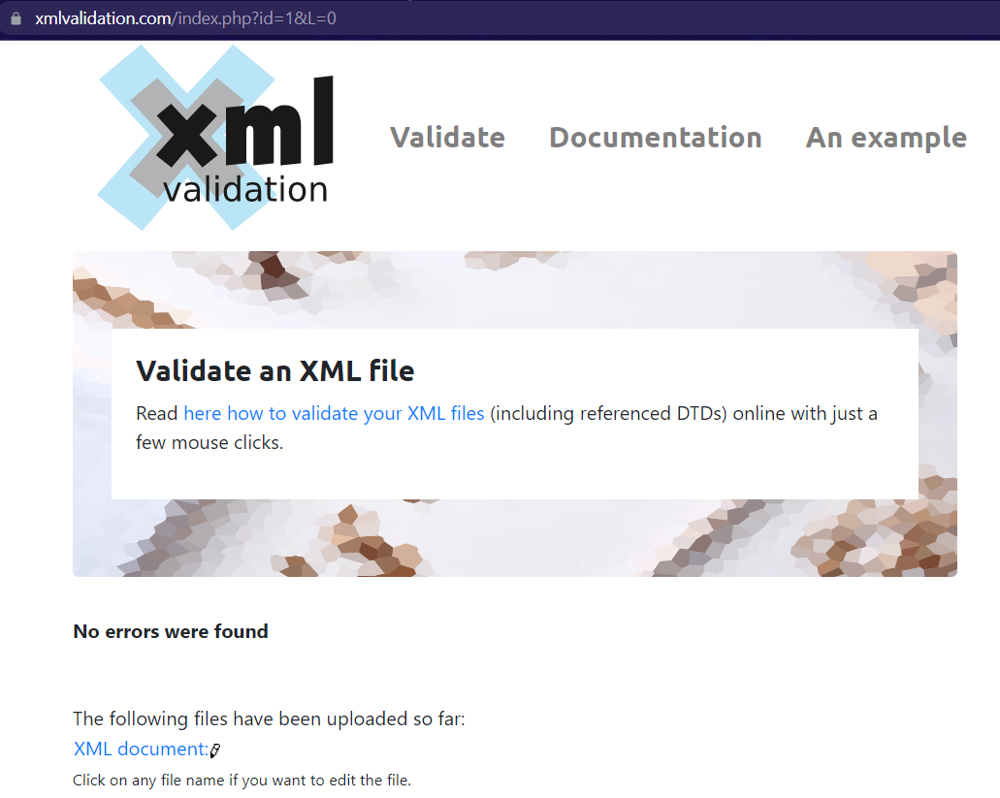
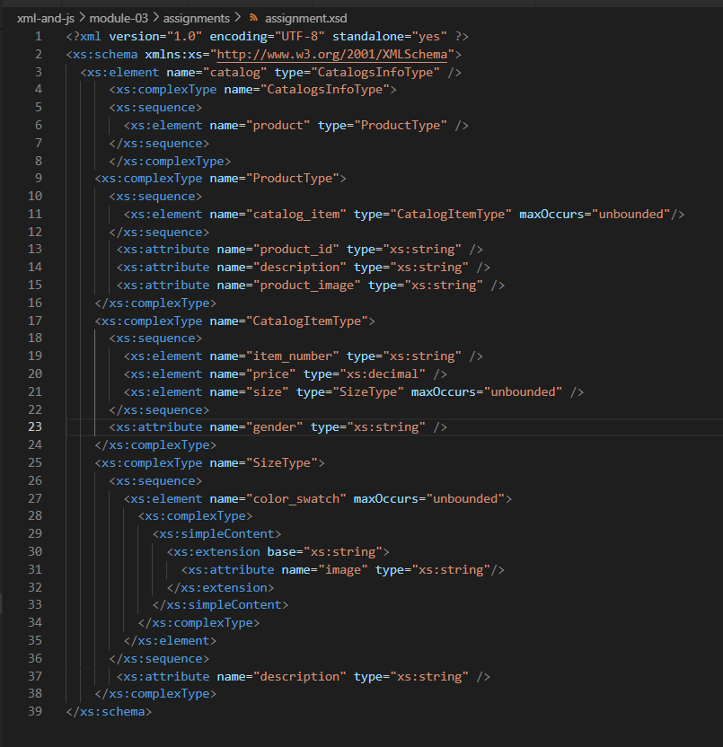
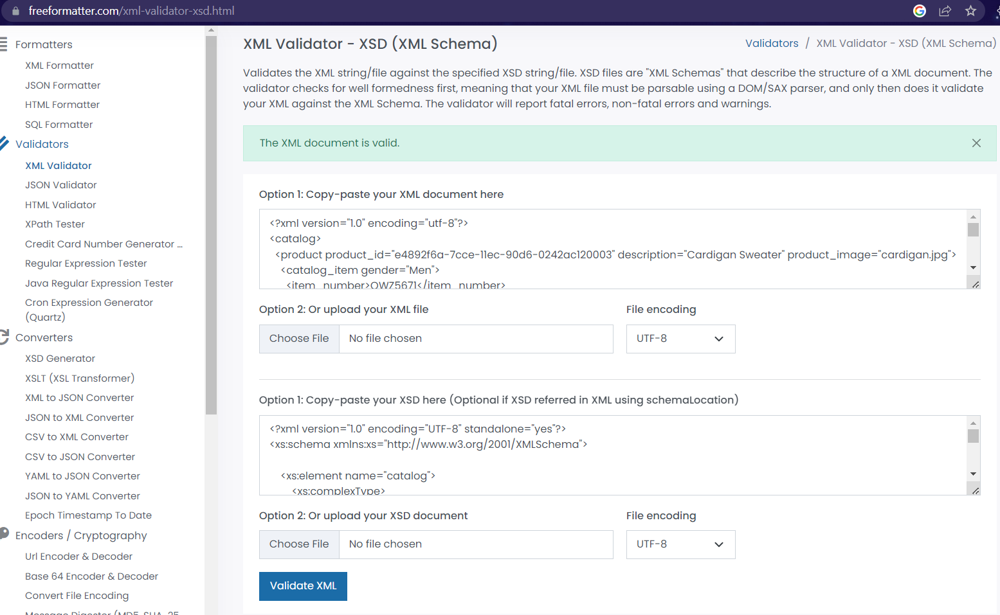

# Assignment 2
# Garima Wadhwa
# n01552997

1. 

2. 

3.Both DTD and XSD define the structure of an XML document.
 In DTD we just mention the name of element and attribute type but in xsd more details are provided such as ocurrence count,data types  in the model.Created xsd using xml and no separate syntax was required as in DTD.