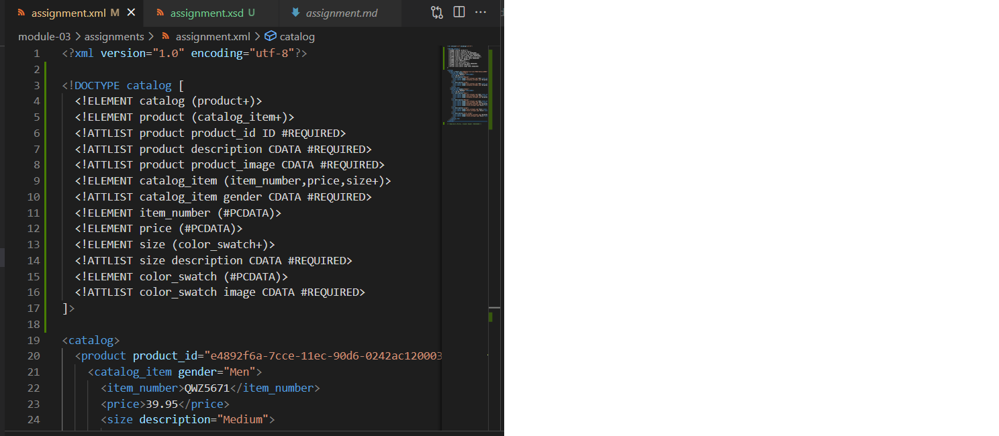
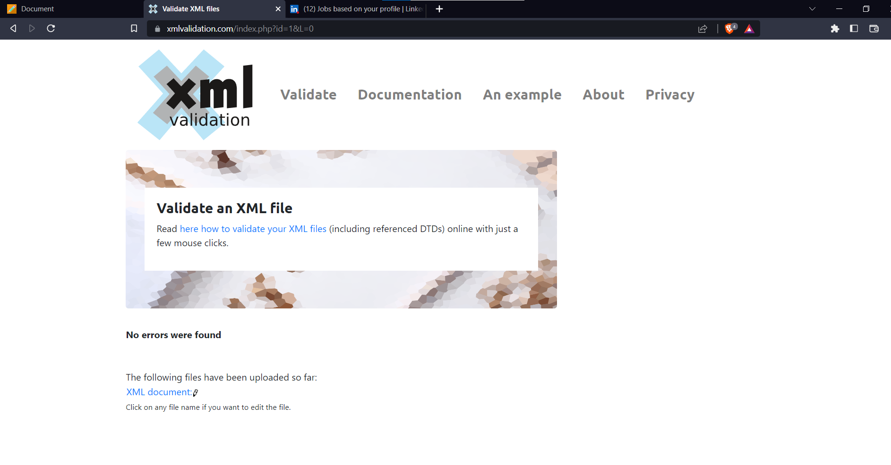
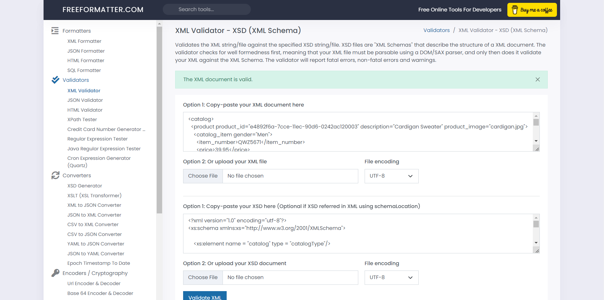

Solution 1) 

Solution 2) 
            

Solution 3) 
             

Solution 4) DTD uses a compact but less expressive syntax whereas XSD is extensive and more expressive. In DTD, we cannot have namespace and the datatypes while XSD supports namespace and datatypes. DTD is used to describe the structure of an XML document as compared to XSD which describes the structure as well as the content(as it supports datatypes) of the XML document.