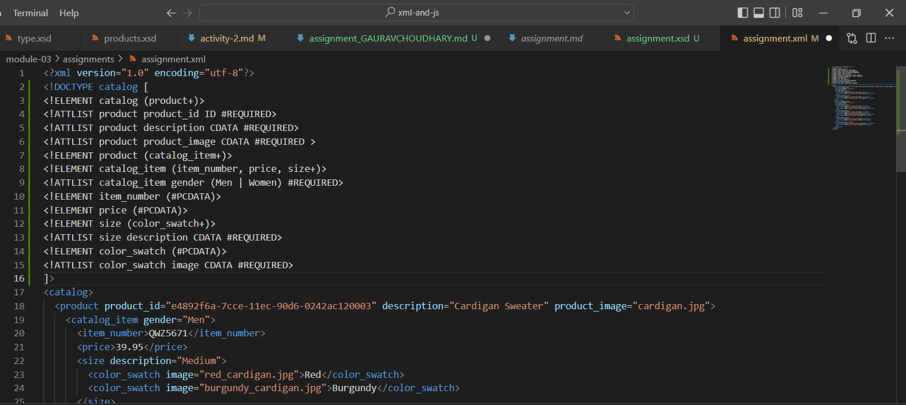
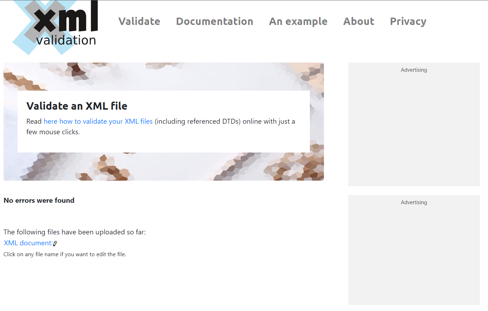
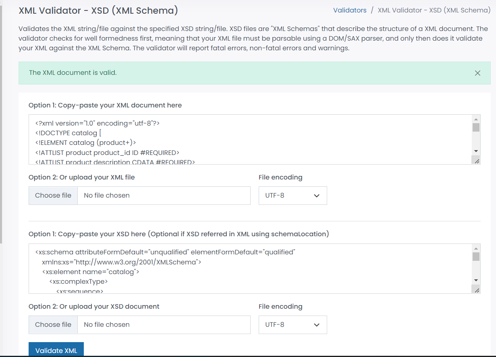

# Assignment

1. Open `module-3/assignments/assignment.xml` in your editor
Ans. 

2. Create DTD for this file and validate it using any of the tools we used
Ans. 
<!ELEMENT catalog (product+)>
<!ATTLIST product product_id ID #REQUIRED>
<!ATTLIST product description CDATA #REQUIRED>
<!ATTLIST product product_image CDATA #REQUIRED >
<!ELEMENT product (catalog_item+)>
<!ELEMENT catalog_item (item_number, price, size+)>
<!ATTLIST catalog_item gender (Men | Women) #REQUIRED>
<!ELEMENT item_number (#PCDATA)>
<!ELEMENT price (#PCDATA)>
<!ELEMENT size (color_swatch+)>
<!ATTLIST size description CDATA #REQUIRED>
<!ELEMENT color_swatch (#PCDATA)>
<!ATTLIST color_swatch image CDATA #REQUIRED>
]>

3. Create XSD for this file and validate it using any of the tools we used
Ans. 
<xs:schema attributeFormDefault="unqualified" elementFormDefault="qualified"
xmlns:xs="http://www.w3.org/2001/XMLSchema">
<xs:element name="catalog">
    <xs:complexType>
        <xs:sequence>
            <xs:element name="product">
                <xs:complexType>
                    <xs:sequence>
                            <xs:element name="catalog_item" maxOccurs="unbounded" minOccurs="0">
                                <xs:complexType>
                                    <xs:sequence>
                                        <xs:element type="xs:string" name="item_number"/>
                                        <xs:element type="xs:float" name="price"/>
                                        <xs:element name="size" maxOccurs="unbounded" minOccurs="0">
                                            <xs:complexType>
                                                <xs:sequence>
                                                    <xs:element name="color_swatch" maxOccurs="unbounded" minOccurs="0">
                                                        <xs:complexType>
                                                            <xs:simpleContent>
                                                                <xs:extension base="xs:string">
                                                                    <xs:attribute type="xs:string" name="image" use="optional"/>
                                                                </xs:extension>
                                                            </xs:simpleContent>
                                                        </xs:complexType>
                                                    </xs:element>
                                                </xs:sequence>
                                                <xs:attribute type="xs:string" name="description" use="optional"/>
                                            </xs:complexType>
                                        </xs:element>
                                    </xs:sequence>
                                    <xs:attribute type="xs:string" name="gender" use="optional"/>
                                </xs:complexType>
                            </xs:element>
                        </xs:sequence>
                        <xs:attribute type="xs:string" name="product_id"/>
                        <xs:attribute type="xs:string" name="description"/>
                        <xs:attribute type="xs:string" name="product_image"/>
                    </xs:complexType>
                </xs:element>
            </xs:sequence>
        </xs:complexType>
    </xs:element>
</xs:schema>

4. Explain your thought process for these 2 declarations.

Create `module-3/assignments/assignment_YOURNAME.md` and add your theory answers. Add screenshots of each step to the file.