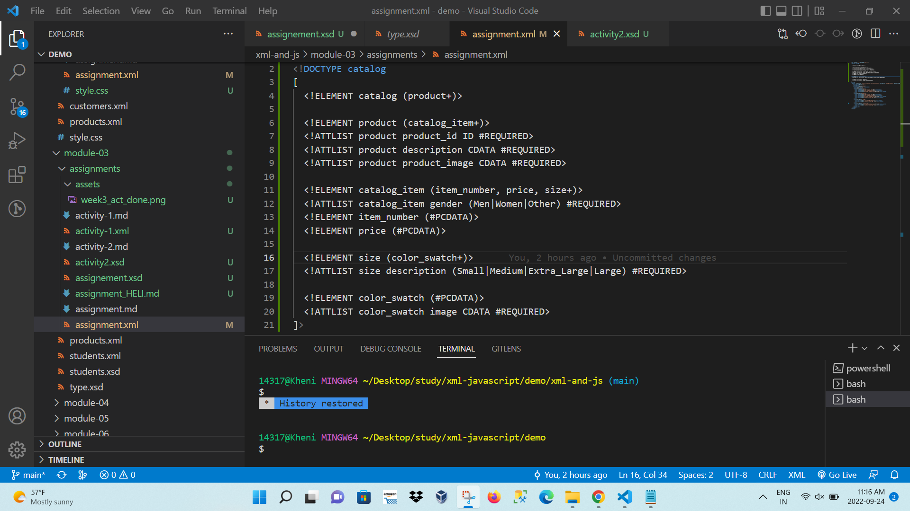
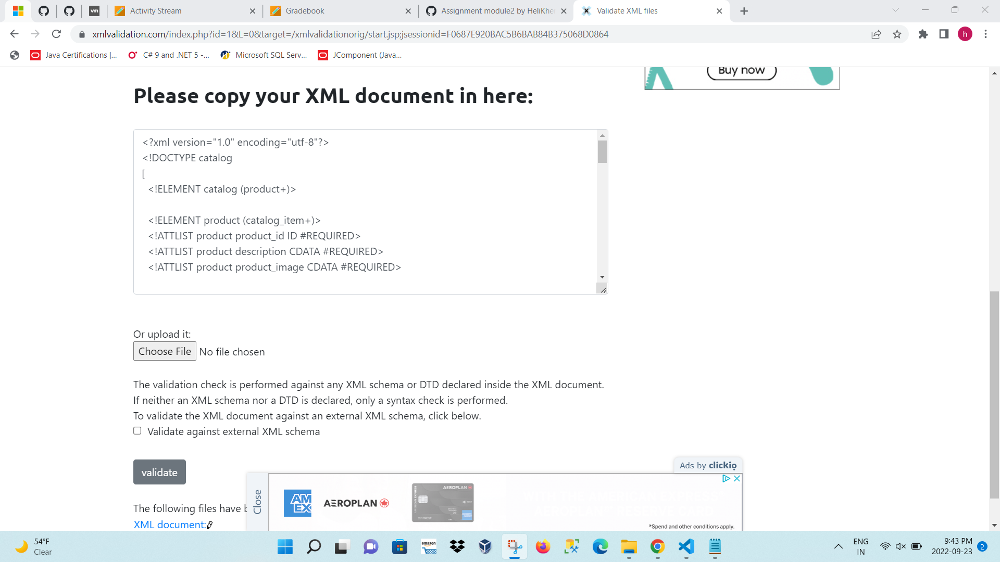
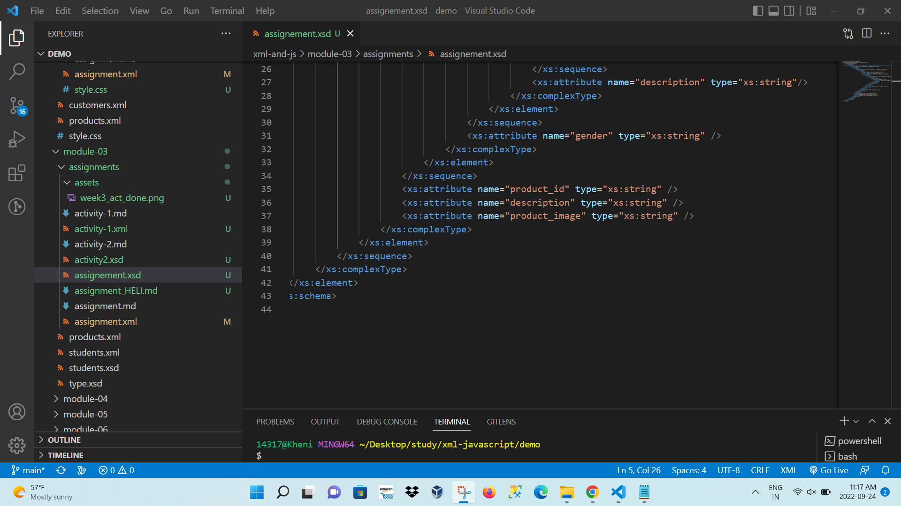
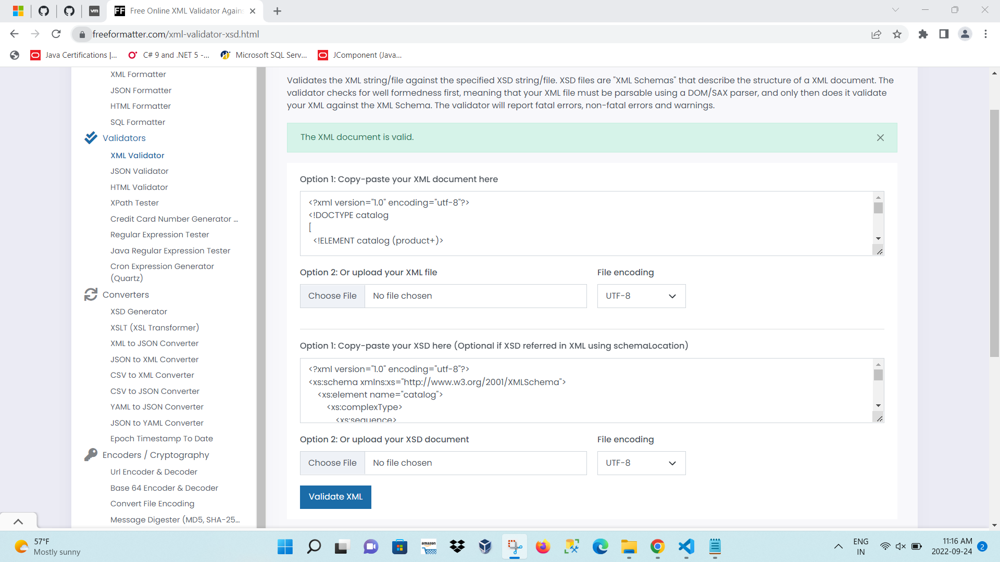

# Assignment

1. Open `module-3/assignments/assignment.xml` in your editor
2. Create DTD for this file and validate it using any of the tools we used
ANS. DTD

Validation:

<!DOCTYPE catalog
[
  <!ELEMENT catalog (product+)>

  <!ELEMENT product (catalog_item+)>
  <!ATTLIST product product_id ID #REQUIRED>
  <!ATTLIST product description CDATA #REQUIRED>
  <!ATTLIST product product_image CDATA #REQUIRED>

  <!ELEMENT catalog_item (item_number, price, size+)>
  <!ATTLIST catalog_item gender (Men|Women|Other) #REQUIRED>
  <!ELEMENT item_number (#PCDATA)>
  <!ELEMENT price (#PCDATA)>
 
  <!ELEMENT size (color_swatch+)>
  <!ATTLIST size description (Small|Medium|Extra_Large|Large) #REQUIRED>
  
  <!ELEMENT color_swatch (#PCDATA)>
  <!ATTLIST color_swatch image CDATA #REQUIRED>
]>

3. Create XSD for this file and validate it using any of the tools we used
ANS. 

FILE:
    assignement.xsd
VALIDATION:

4. Explain your thought process for these 2 declarations
ANS--
DTD - In assignment.xml file root element is CATALOG. So I start dtd with DOCTYPE declaration with catalog tag. Then catalog element has PRODUCT tag. here i use + because i am thinking that
in one catlog there is multiple products.Then product tag has subelements and attributes. then i define element of product is CATALOG_ITEM. Here also i used + because of there is multiple catlog_items in product. product has 3 attributes. First is product_id, its type is ID and it is required field so i wrote #REQUIRED.Then desciprion and producat_image both are data so i wrote CADATA and also define as required.
Then catlog_item has 3 elements and 1 attribute. item_number is element of catlog_item and it has no subelements so i wrote PCDATA with this. price is also PCDATA. Here i wrote size+ because there are more than one size tag inside catlog_item.catlog_item has one attribute gender. here i wrote option men,women and other. this is enumerable type data. it define that gender value can be these 3 value only.
SIZE has one element color_swatch, it is also multiple time in document so i wrote +.Size has one attribute description. here also i wrote options small, medium, large and extra-large.Because i think that description means these values only , after looking at file.
COLOR_SWATCH is type of PCDATA, because it has no sub element. and its data is string format.
It has one attribute image which is also cdata attribute.

XSD -
I make a new file assignment.xsd and first xml declarationa and then schema.We have to write SCHEMA tag with namespace and prefix xs. then we can use xs tags in our xsd file.
first element is catalog so i write xs:element tag with name CATALOG. It has subelement so it is completype. Inside that PRODUCT element is there. Product can be more that once. So i set minOccurs as 1 and maxOccurs as unbounded same like + in dtd. It also has subelements so its type is complex type. It 3 attribut mention after sequence tag. product_id, description and product_image. these all 3 attributes has data as alpha-numeric so i choose string datatype.
product has subelement CATALOG_ITEM which is also complex type. It is more than once in file so i set minOccurs and maxOccurs. It has 3 elements and 1 attribut. Atrribute name is gender and it type is string. 1st element of catlog_item is ITEM_NUMBER and it has no subelements and attributes so i write its type as string because it has string data. Then PRICE is also not complex type and it has data with number in decimal format. so i write it type as decimal. then last element of catalog_item is SIZE.It is available multiple time so minOccus is 1 and macOccurs is unbounded. It is complex type.It has attribut description with string type and one elment COLOR_SWATCH.
color_swatch is complex simple type element. because it has no elements but has one attribute.so i write completype and simplecontent tags.then its attribut is string type and extension base is also string. it name is image and type is string.