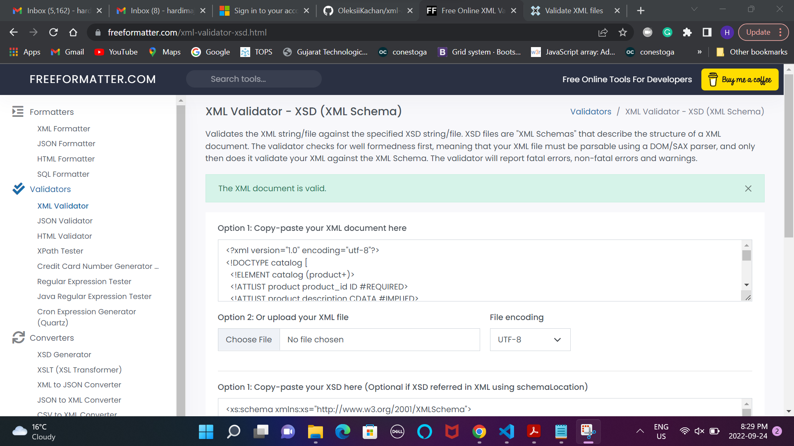

--> Thought process of DTD:
      Catalog is the root element in which one product element with 3 attributes are included.
      The product element has one or more catelog_item.
      catelog_item has one attribute gender and three elements (item_number,price and size).
      The gender attribute must have atleast one value Men or Women value.
      The size element canbe one or more.
      The size element have one attribute description which have atleat one value (small, medium,large,extra large).
      The size element can have one or more color_swatch element. 
      The color_swatch has one image attribute.
  

--> Thought process of XSD:

    Catalog is the complex type of element.
    Product is complex element with a sequenece of catelog_item and attribute.
    catalog_item is a complex element with a sequence.
    catelog_item is a complec element with a attribute named CatalogItem.
    CatalogItem has three elements (item_number,price,size).
    size is complex element with one attibute and sequence.
    color_swatch is complex with simple type with base string.
   
   