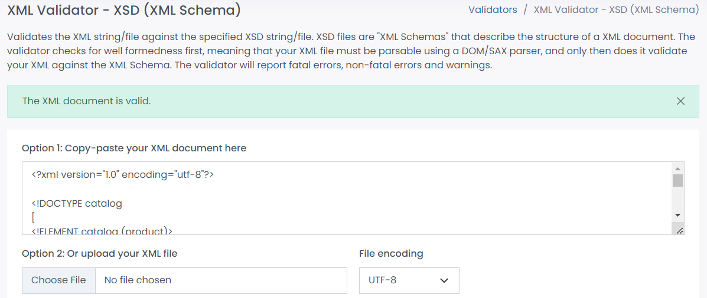
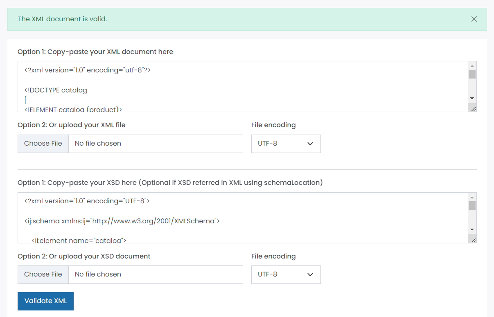

1. Open `module-3/assignments/assignment.xml` in your editor

2. Create DTD for this file and validate it using any of the tools we used
    
    XML file of assignment including DTD is created separately.

3. Create XSD for this file and validate it using any of the tools we used
    
    XSD file of assignment including is created separately.
    
4. Explain your thought process for these 2 declarations
    According to my thought process , I find XSD (XML Schema Definition ) much easier than DTD(Document Type Definition) because it is more simpler to understand , learn and read the definition of the document.It contains namespace and supports datatypes which makes it more extensible.

Create `module-3/assignments/assignment_YOURNAME.md` and add your theory answers. Add screenshots of each step to the file.