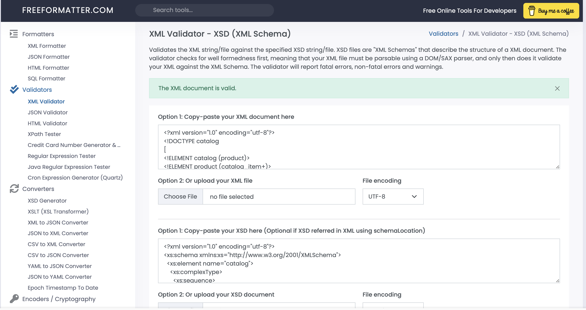

1. DTD File Validation

2. XSD Verification

3. Thought Process:
=> We can see here in the information given that, we just have to clarify the size. Because size is the only element in this information summary that we need to give it (+) symbol and it will be in the range of 0 to more.
=> We have to put #REQUiRED in the required field.
=> Same way, we have to apply on all of these elements.

=> XSD file is the element information we have to describe. We don't have to describe information and data about those.