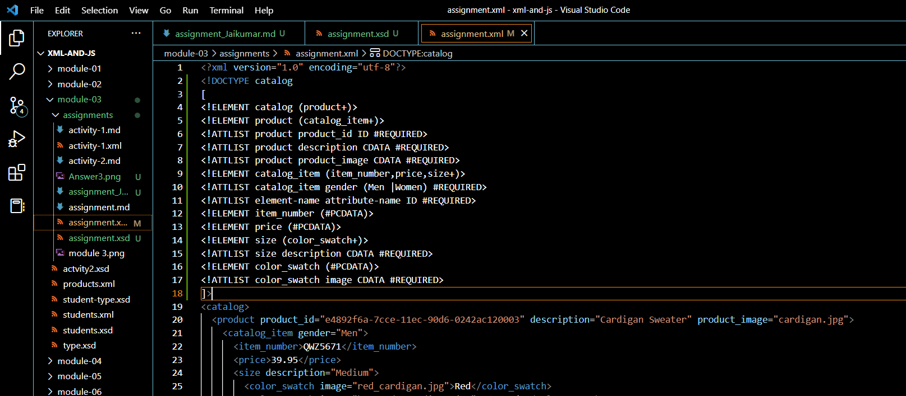
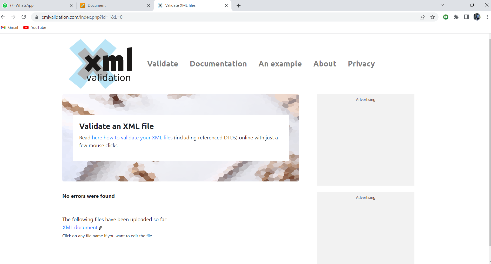
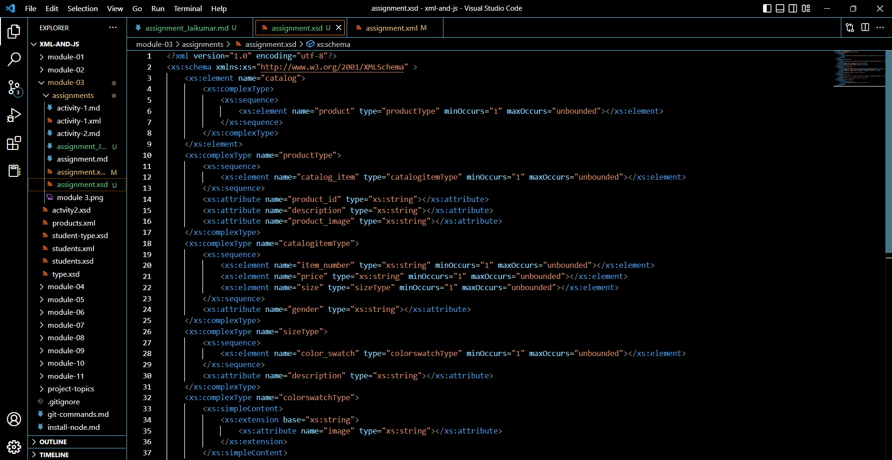

Name: Jaikumar Anilkumar Darji
ID: n01561627

Answer2: 
        

Answer3: 
        

Answer4:
         XSD is extensive and more expressive than DTD, which utilises a more condensed but less expressive.. While XSD supports namespace and datatypes, DTD does not. In contrast to XSD, which describes both the structure and content (since it supports datatypes) of the XML document, DTD is used to describe the structure of an XML document.

