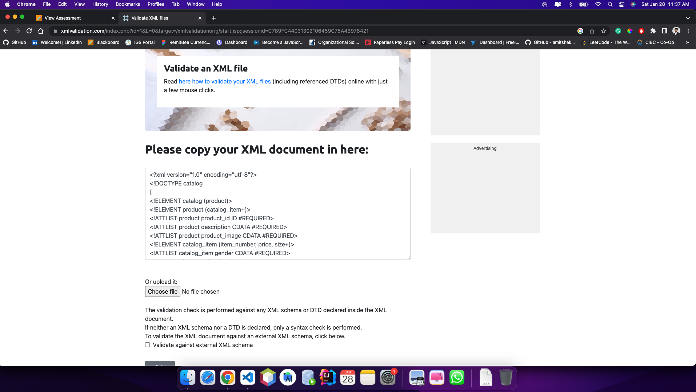
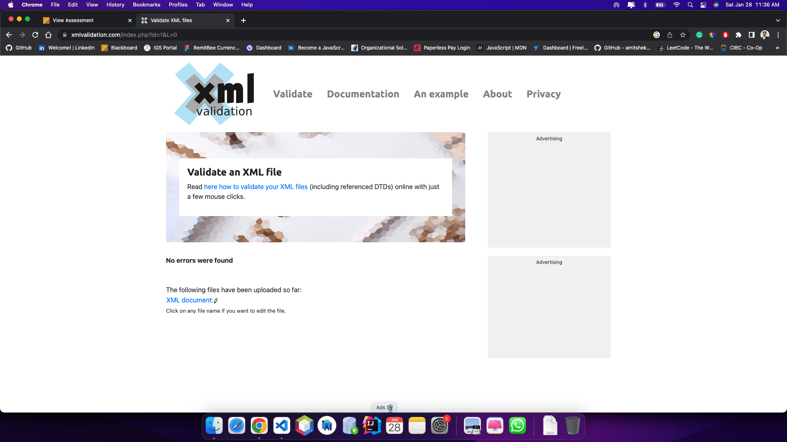

DTD is a bit lengthy task to do whereas XSD is a bit informative and simpler. It helps to validate text element
content based on buit-in and user defined data types unlike DTD.
XSD took less time compared to DTD.