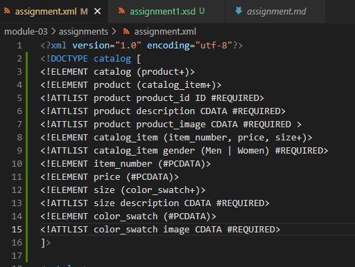
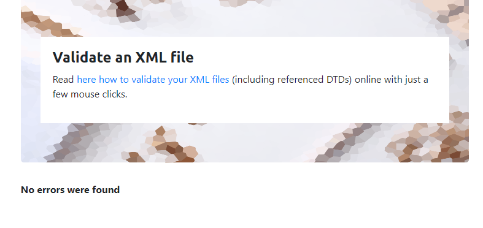
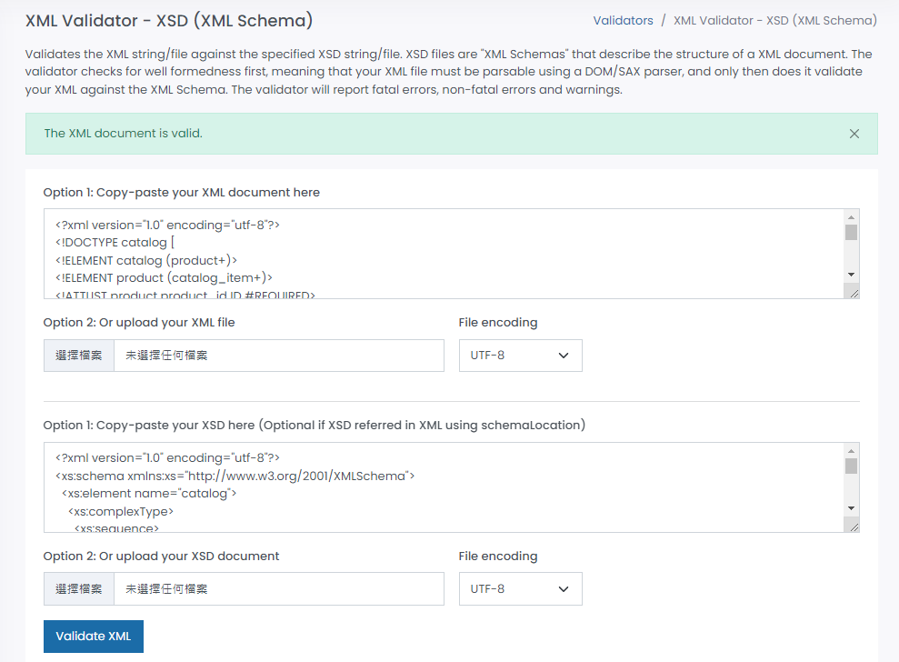

# Module-03 Assignment

2. DTD: 
 

Validation: 
 

3. XSD: 
 

Validation: 
 

4. Explain your thought process for these 2 declarations: 
DTD: 
- 'catalog' is root elememt. 
- 'product' is the child element of the 'catalog'. The 'product' element has three required attributes which are 'product_id', 'description' and 'product_image'. 
- 'catalog_item' is the child element of the 'product'. The 'catalog_item' has a required attribute 'gender' that specifies the values of Men and Women.
- 'item_number', 'price' and 'size' are the child elements of the 'catalog_item'. Both 'item_number' and 'price' store character data. 
- The 'size' occurs more than one times. It has a required attribute named 'description'. 'color_swatch' is the child element of the 'size'. It has a required attribute 'image'. 

XSD: 
- 'catalog' is a complex type element. It has a sequemce element 'product'
- 'product' is a complex type element. It has three required attributes which are 'product_id', 'description' and 'product_image'. The 'product' has a sequemce element 'catalog_item'. 
- 'catalog_item' is a complex type element. It has a required attribute 'gender'. The 'catalog_item' has the elements of 'item_number', 'price' and 'size' in the sequence element.
- Both 'item_number' and 'price' are simple type elements.
- 'size' is a complex type element. It has a required attribute 'description'. The 'size' has a sequemce element 'color_swatch'.
- 'color_swatch' is a complex type element. It has a required attribute 'image'.

