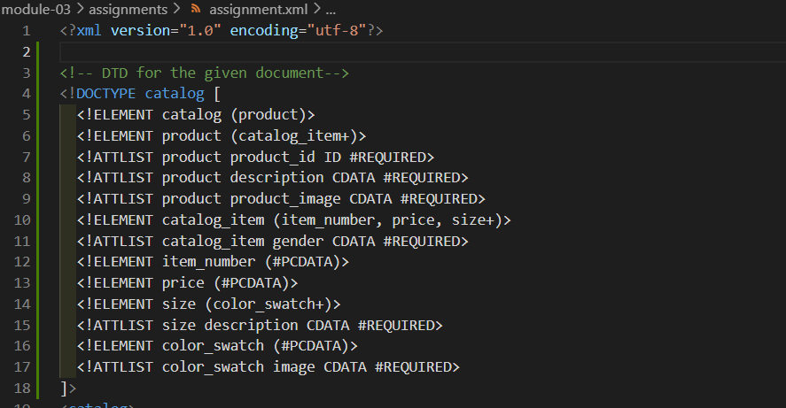
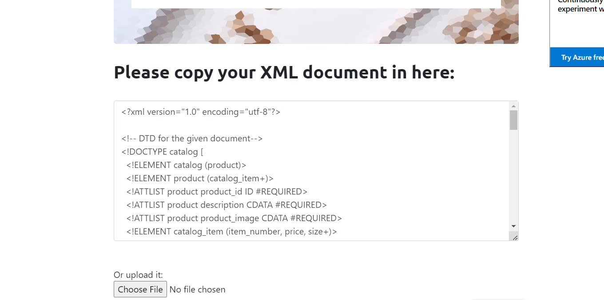
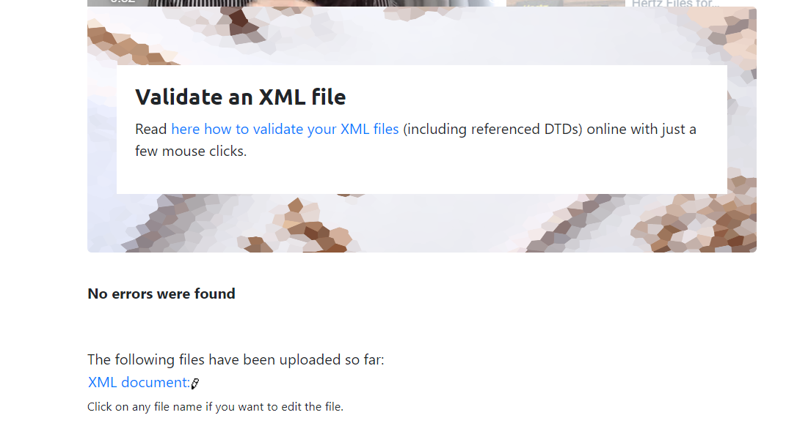
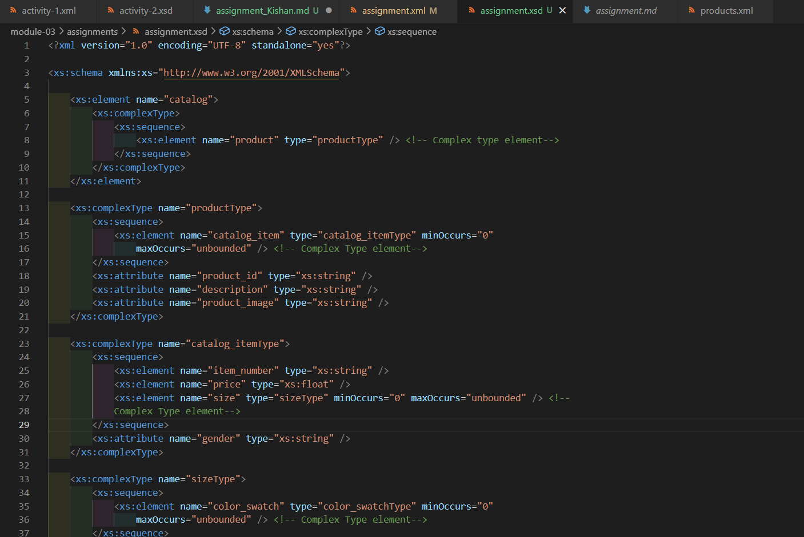
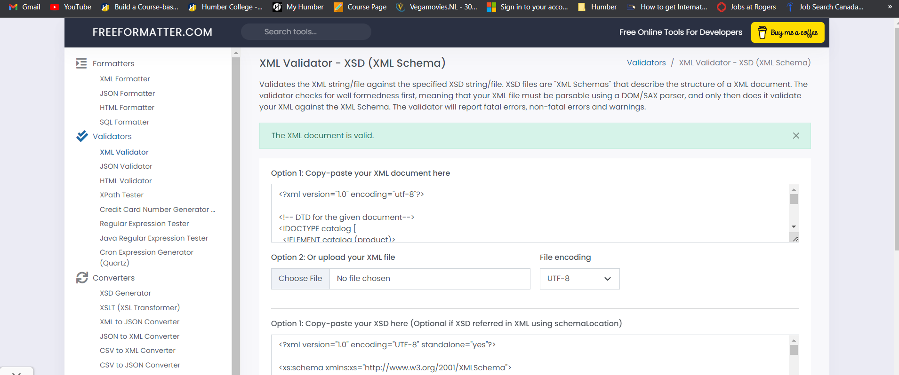

<!-- Assignement-2
    Kishan Patel
    N01554260 -->

1. Open `module-3/assignments/assignment.xml` in your editor

2. Create DTD for this file and validate it using any of the tools we used

   Answer-> DTD for the assignment.xml is added in the same file from line-3 to 18.
   
   
   

3. Create XSD for this file and validate it using any of the tools we used

   Answer-> XSD for the assignment.xml is added in the assignment.xsd file in the same directory.
   
   

4. Explain your thought process for these 2 declarations

   Answer-> For DTD declaration, The main task is to find out and understand the tree structure of root element and other elements inside it along with the attributes they have inside ech element. We must declare attribute, structure and type of element for DTD with the given pre-defined datatype to parse without any error in file.

   -> For XSD documentation, It is almost same as DTD but instead of declaring elements with General datatype name than Difficult to remember names like string instead of CDATA. Also, in terms of attribute declaration, It is much easier in XSD. Just need to follow proper method for identifying and writing complex elements.

   -> So, All in all, XSD is a bit lenghty but easier than DTD declaration as per my opinion.
