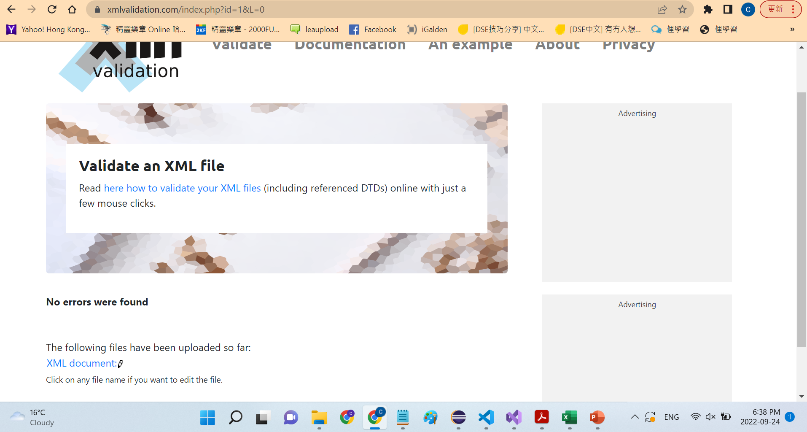

## Question 2

## Question 3

## Question 4
-   I have to draft a tree diagram showing the relationship between the elements and also mark down any attributes.
-   There are squence and multiple attributes for product.
-   There is sequence and attribute in catalog_item.
-   There is sequence in size and within size there is sequence which is color_swatch where both size and color_swatch has attribute.