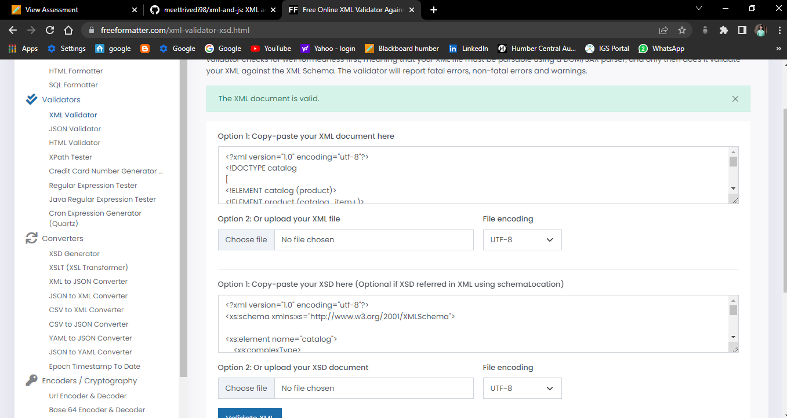

# Assignment
2. Create DTD for this file and validate it using any of the tools we used
3. Create XSD for this file and validate it using any of the tools we used

4. Explanation of DTD
- DTD is used to define structure of XML body, in which it gives info about list and elements is used in given XML file.

5. XSD 
- It is used for defining the schemas of XML file, for this assignment file assignment_xsd is here.
