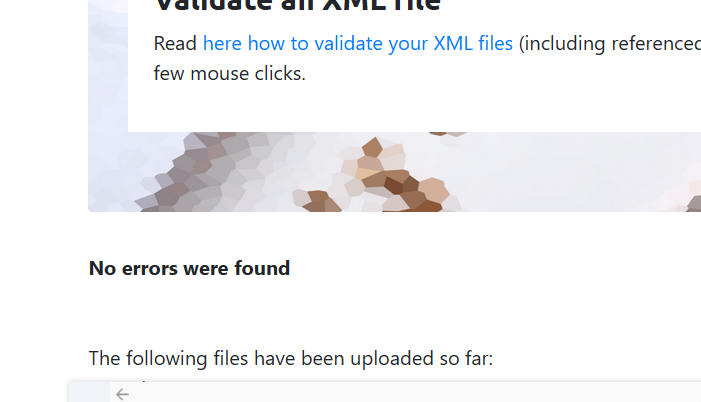

# Assignment 1 
# Milap Singh
# N01552120

2. Create DTD for this file and validate it using any of the tools we used
    

3. Create XSD for this file and validate it using any of the tools we used
    

4. Explain your thought process for these 2 declarations.

    in my prespective dtd is easy but it doesnt give much info about the xml file layout 
    also xsd is written similar to the xml file and more readable as it is well indented.

