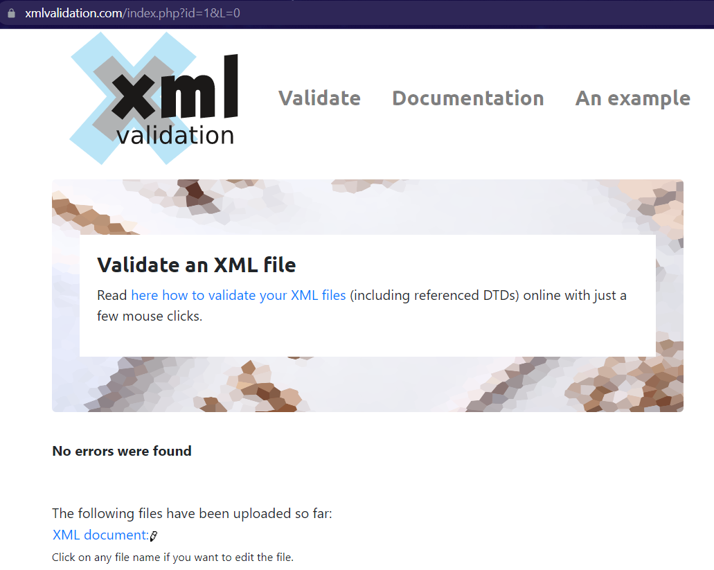

2. Create DTD for this file and validate it using any of the tools we used.
        
        
    
3. Create XSD for this file and validate it using any of the tools we used.
        

4. Explain your thought process for these 2 declarations.
Answer:
==>     In DTD declaration our first task is to figure out the root element along with other elements which are inside the root element. the second step is, we need to define the attribute, element structure and its type. In the end, you can validate the DTD with any online validation tool.

==>     XSD is more specific and structured as compared to DTD. First, we need to define the relationship between an element and an attribute in an XML file into specifying sequence. we also need to define complex types and groups of elements in XSD. After that, we need to add some constraints to its data type. after all, we can do the validation by any online tool.

==>     Conclusion: XSD is better and more readable than DTD because XSD is more specific.