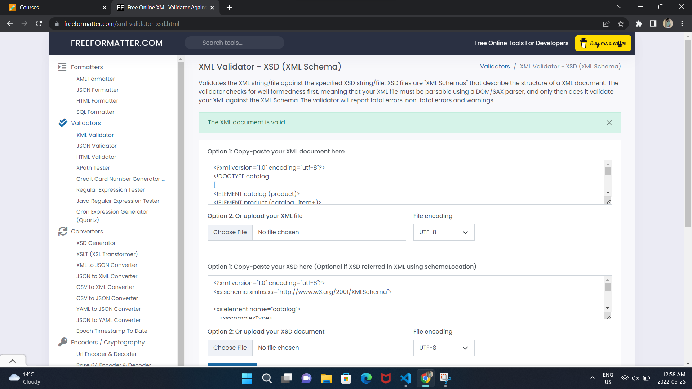

2. Create DTD for this file and validate it using any of the tools we used

3. Create XSD for this file and validate it using any of the tools we used

4. Explain your thought process for these 2 declarations
Document Type Declaration, known as DTD, is used to define the structure of the XML document. In the DTD, we define all the elements and its attributes. A DTD document starts with DOCTYPE decalaration followed by the root element. All the elements and attributes are enclosed inside the square brackets. DTD defines the type of data placed in an element. For instance, <!ELEMENT price (#PCDATA)> defines that element price is of type parsed character data. 

XML Schema Defintion (XSD) is also used to define and validate the structure of the XML document. XSD defines the elements, attributes and data types. XSD supports namespaces, which helps to avoid naming conflicts. The root element of the xsd is <schema/>. We can define XML schema elements as simple and complex type. Simple type is used for only text. Complex type is used to specify the child elements of an element. 