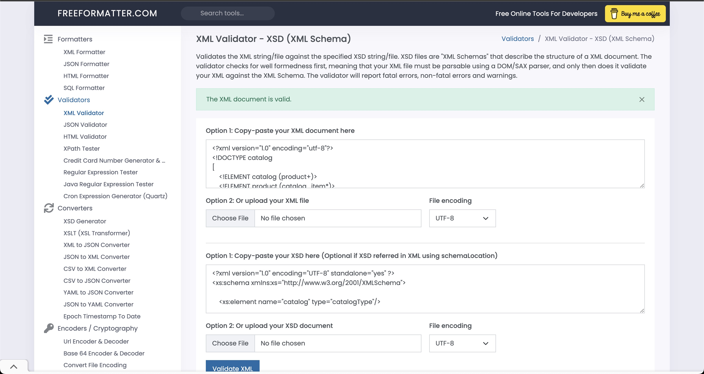

1. Open module-3/assignments/assignment.xml in your editor
        - 
        - I fixed it using adding type="Date" attribute in effective tag.
2. Create DTD for this file and validate it using any of the tools we used
    - 
3. Create XSD for this file and validate it using any of the tools we used
    - 
    - Added in the assignment.xml file.
4. Explain your thought process for these 2 declarations
    - DTD Process:
        - DTD is something whicb we have to think in more deep than XSD to get clear idea about declaration.
    - XSD Process:
        - XSD's declaration type is more understanable than DTD because it is similar to other programming language structure like HTML.