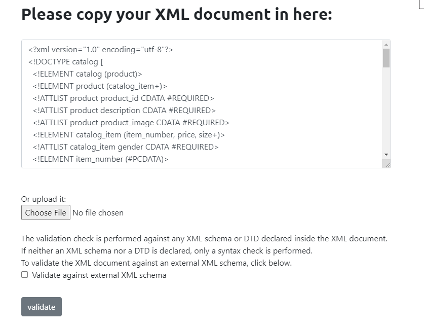
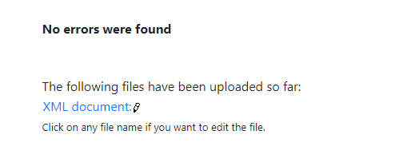
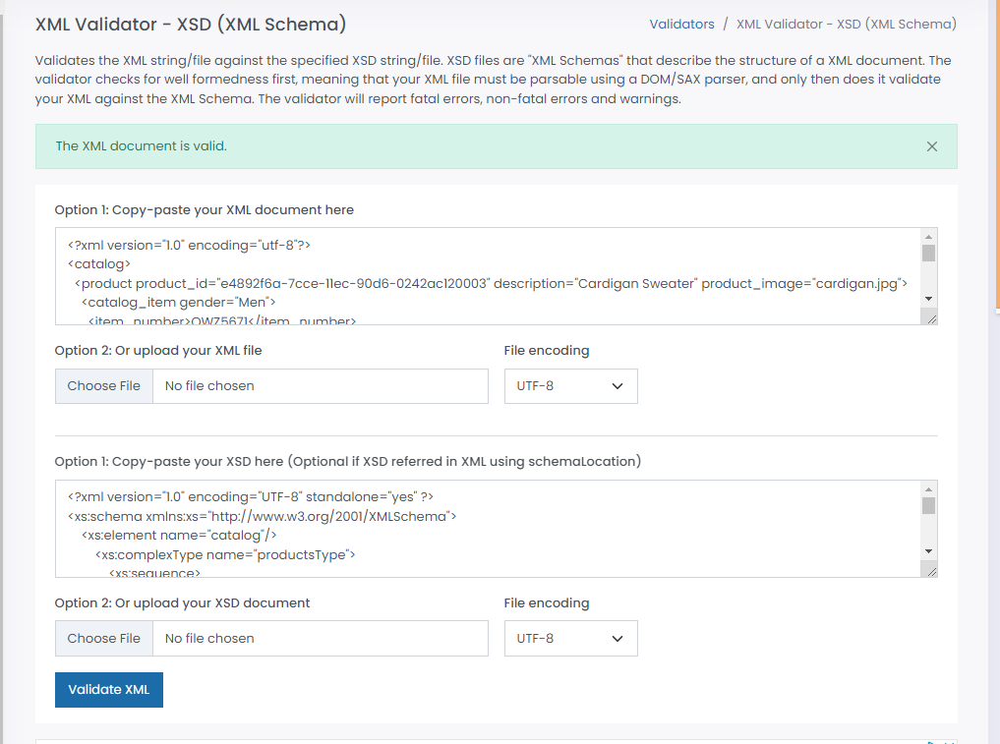

# Assignment

1. Open `module-3/assignments/assignment.xml` in your editor
2. Create DTD for this file and validate it using any of the tools we used

<!DOCTYPE catalog [
  <!ELEMENT catalog (product)>
  <!ELEMENT product (catalog_item+)>
  <!ATTLIST product product_id CDATA #REQUIRED>
  <!ATTLIST product description CDATA #REQUIRED>
  <!ATTLIST product product_image CDATA #REQUIRED>
  <!ELEMENT catalog_item (item_number, price, size+)>
  <!ATTLIST catalog_item gender CDATA #REQUIRED>
  <!ELEMENT item_number (#PCDATA)>
  <!ELEMENT price (#PCDATA)>
  <!ELEMENT size (color_swatch+)>
  <!ATTLIST size description CDATA #REQUIRED>
  <!ELEMENT color_swatch (#PCDATA)>
  <!ATTLIST color_swatch image CDATA #REQUIRED>
]>

3. Create XSD for this file and validate it using any of the tools we used

4. Explain your thought process for these 2 declarations

In creating a Document Type Definition (DTD) declaration, I drew upon my prior examples and formulated the structure based on those. However, I found the DTD to be relatively inflexible in terms of the datatype options available, but the syntax was relatively simple. In contrast, the process of creating an XML Schema Definition (XSD) was more logical and intuitive. I believe that XSD offers greater power and flexibility, as well as a wider range of options for defining the datatype that are more meaningful in context.

Create `module-3/assignments/assignment_YOURNAME.md` and add your theory answers. Add screenshots of each step to the file.
