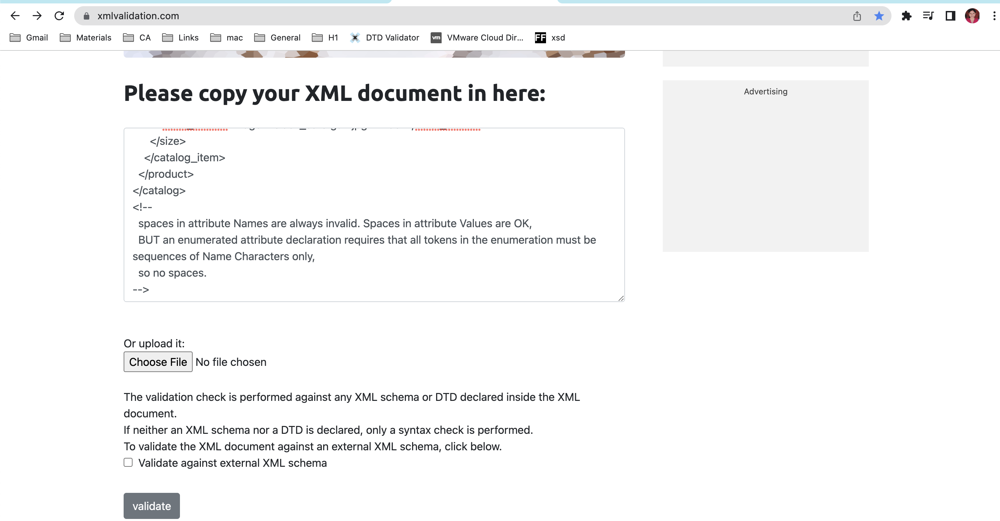
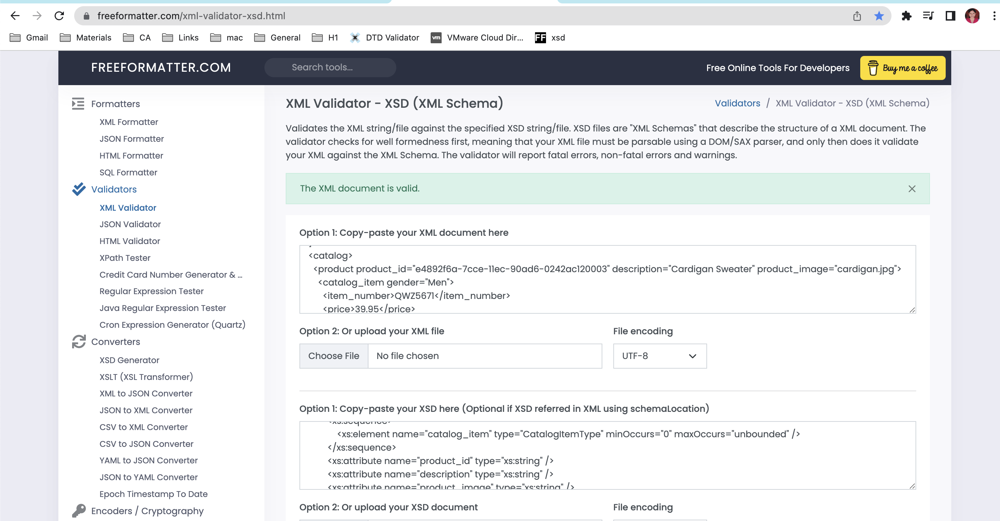

# Assignment

1. Open `module-3/assignments/assignment.xml` in your editor
Corresponding xml file is opened.

2. Create DTD for this file and validate it using any of the tools we used

assignment.xml file is updated with DTD and validated successfully.

image: 
 

3. Create XSD for this file and validate it using any of the tools we used

assignment.xsd file is created and validated successfully.

image: 

4. Explain your thought process for these 2 declarations

Like DTDs, XML Schemas are used for defining XML vocabularies.They describe the structure and content of XML documents in more
detail than DTDs.
One complaint about DTDs is their lack of data types. It uses #PCDATA which is a string data type. Whereas XSD uses fundamental and primitive data types.
DTD File is saved as .xml andFile in XSD is saved as .xsd file.
DTD is not extensible in nature. XSD is extensible in nature.
DTD doesn’t give us much control on structure of XML document.XSD gives us more control on structure of XML document.
XSD is simple to learn ,write and understand comared to DTD.
DTDs also do not recognize namespaces, so they are not well suited to compound documents in which content from several vocabularies needs to be validated. XML Schemas fully support the Namespace Recommendation.

