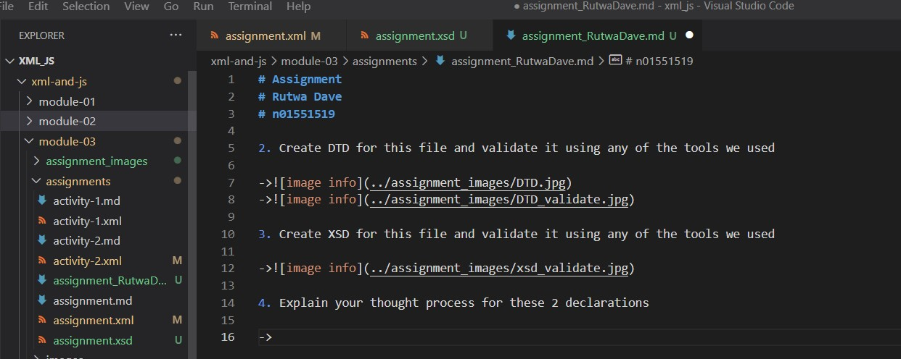
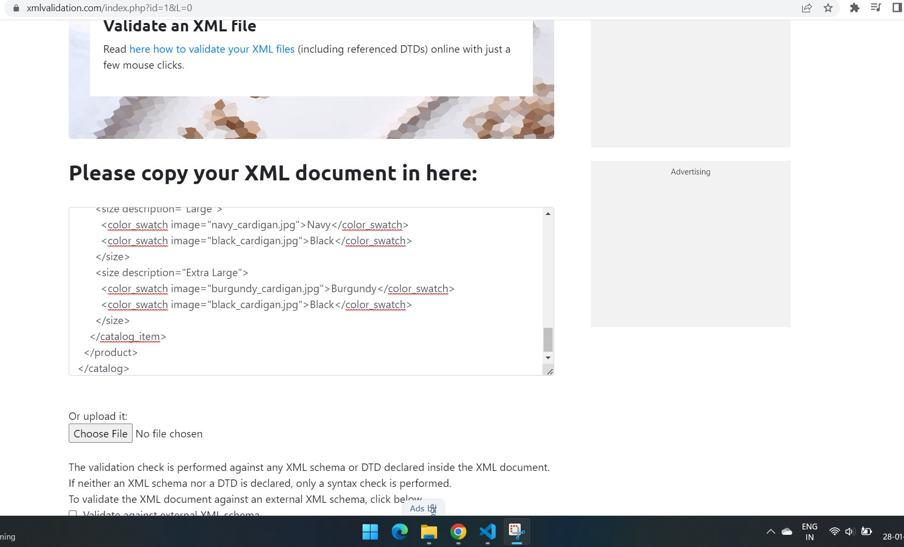
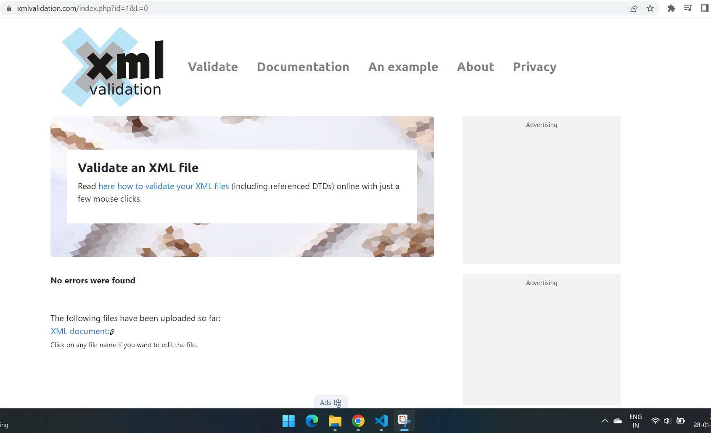
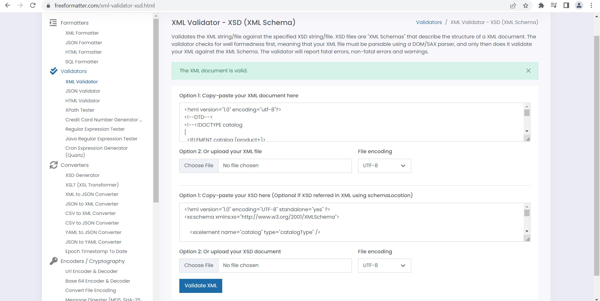

# Assignment
# Rutwa Dave
# n01551519

1. Open `module-3/assignments/assignment.xml` in your editor

->

2. Create DTD for this file and validate it using any of the tools we used

->
->

3. Create XSD for this file and validate it using any of the tools we used

->

4. Explain your thought process for these 2 declarations

->Document Type Definition is more of complex while declaring than xsd, datatypes are not defined which gave me tough time while declaring attributes. There are notations given for defining the type of data to be stores but it's hard to understand and remember.
I particularly faced problem while defining attribute called description in xml tag size and have descriptions of different sizes because attribute value have whitespace in the string.

->XSD is quite of simple as we can define the exact type of data to be stored let it be string, decimal, integer also it supports ordered format as xml as it is written in XML.
->Complex elements are elements that have nested elements and attributes within, it is easy to understand the declaration.
-> While simple elements are elements have no attributes
->Also, xsd is extensible datatypes can be derived.