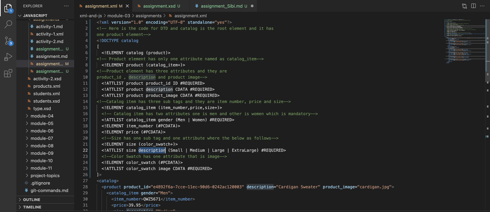
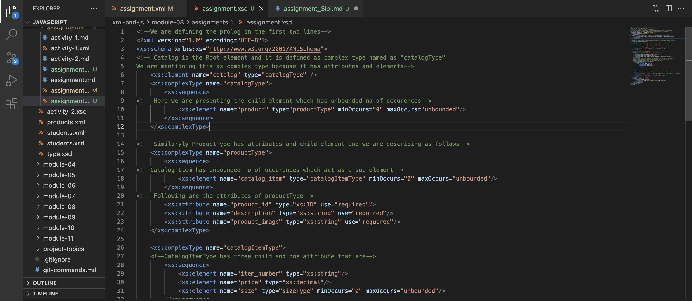

# Assignment 2
1. DTD stands for Document Type Definition which defines the structure of an XML document. We are declaring the DTD which starts with 
<!DOCTYPE root_element [
    
    and ends with 
]>
Create the DTD based on the xml file and validate the file. Below is the snapshot for the DTD example.

2. XSD stands for XML Schema Definition. It is used to describe the structure of an elements. It is more powerful than DTD and it is easy to understand and it is an alternative to DTD. We can derive our own datatypes from the standard one's.
It has namespace, elements and attributes with it and the following is the screenshot for reference.

3. I have confirmed with the validation of the DTD file and there are no erros and following is the screenshot of it.

4. Verified with the schema check for xml and xsd files there are no schema errors, below is the snapshot.
