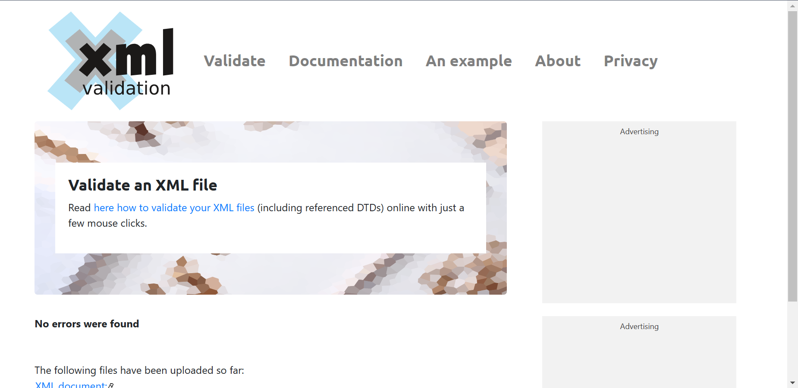
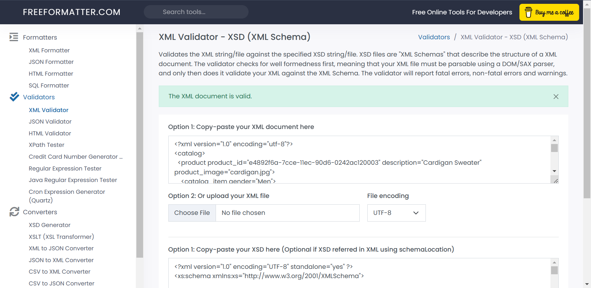

Name:Sirui Zhang

# Assignment

1. Open `module-3/assignments/assignment.xml` in your editor
2. Create DTD for this file and validate it using any of the tools we used

3. Create XSD for this file and validate it using any of the tools we used

4. Explain your thought process for these 2 declarations
DTD: 
1.Line out elements list.
2.Line out relationships between elements, and numbers of child elements.
3.Line out elemtns datatype
4.Line out atrribute under elements;their datatype, and default situation.

XSD:
1.Line out elements list.
2.Line out elemtns' type and numbers of elements to see if need to add minOccur and Maxoccur.
3.Line out relationship between elements.
4.Line out atrribute of elements. And types of atrribute.