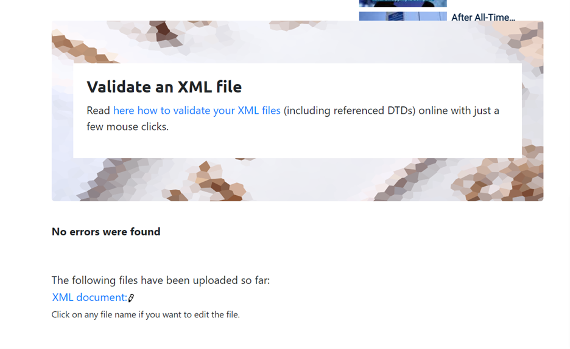

DTD:
For declaring internal DTD the name of root tag comes after the key word DOCTYPE
in this case root element is "catalog"
Aftr that we should declare the element tag which may have child elements and attributes.
For declaring attributes we use ATTLIST , and the type of attributes should be defined.
For example one of the attribute of peoduct is "product_id" which its type is ID.
The order of elements should be followed as they are appeared in both main body and child elements.
The element "catalog_item" has an attribute which its type is Enumerated because included two values "Men | Women".

XSD:
For declaring XSD file first we need to define whether tags are simple or complex.
the element which included child element and attribute consider as complex tag. so they should be parse into simple element then we can declare them. for each simple element we need to define the name, type and max and min occurrence . 
for example , priduct is a complex tag which has child tag (catalog_item) , and catalog_item is a complex tag which has child tag (item_number ,price , size) , and size has child tag named (color_swatch). after parsing all complex tgs into simple tags we need to declare attributes as simple elements as well.

