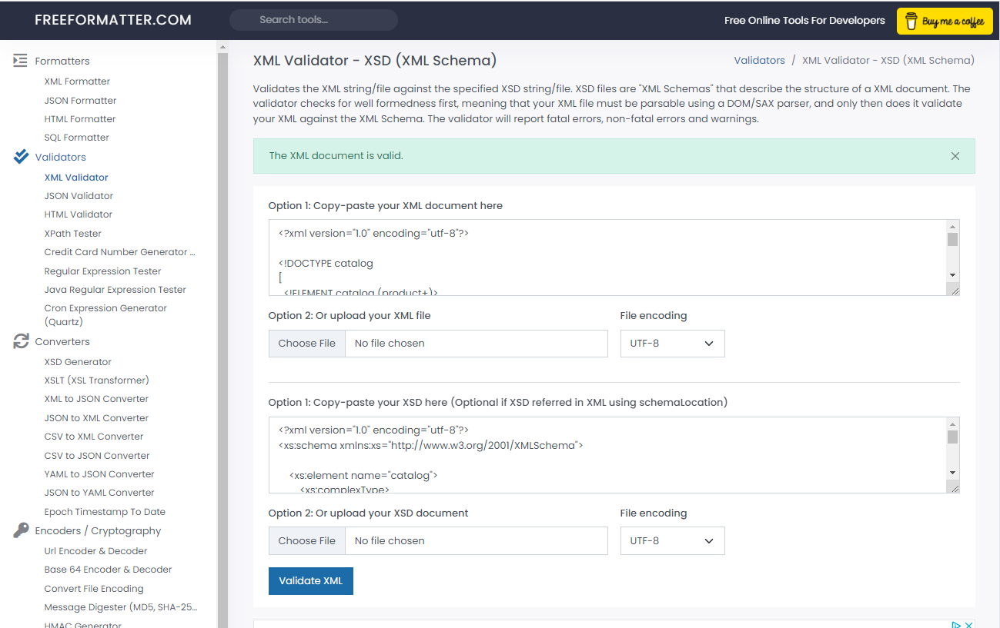

# Assignment
# Name : Teerawut Sangpueng
# Student Id: N01547659

1) Create DTD for this file and validate it using any of the tools we used

2) Create XSD for this file and validate it using any of the tools we used

3) Explain your thought process for these 2 declarations

DTD (Document Type Definition) and XSD (XML Schema Definition) are both ways to define the structure of an XML document.

To declare the DTD, we have to go through each element of the XML and follow the rule of the DTD format, while the XSD is a simple way to define the XML document which is easy to understand the variable and can be created easily. I prefer the XSD format because it is more readable code than the DTD format.