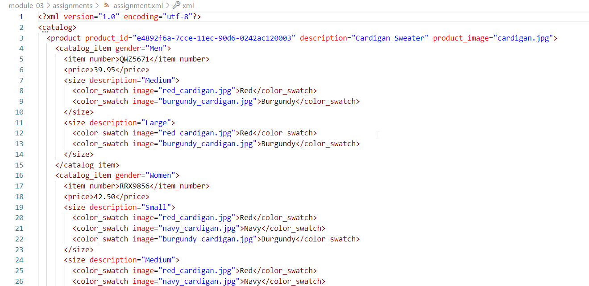

# Assignment 3

1.
2.  
3.  
4. 
    - XSD 
Firstly, I created root element “catalog” and put inside it a sequence of “product” element. In XML file there was only one product, but I logically assumed that catalog might have more than 1 item. Then, I assigned a new type “ProductType” to products to describe it separately. 
ProductType contains a sequence of elements “catalog_item”, and 3 attributes. Attribute “product_id” looks like of type ID, while the other 2 – of type string. I do not think that product can consists of 0 items, so I set minOccurs="1". Again, I created new type “CatalogItemType” to describe it separately. 
“CatalogItemType” consists of item_number, price, at least 1 price, and it has attribute “gender” of type string. One last time, I assigned new type "SizeType” to element “size”. 
"SizeType” consists of al least 1 color_swatch and has 1 attribute “description” of type string. “color_swatch” is a complex type of extension string and with attribute named “image”, also of type string.
    - DTD 
Root element is called “catalog” and it consists of any number of products. Element “product” consists of at least 1 catalog_item, and has 3 required attributes - product_id (ID), description (CDATA), and product_image (CDATA). Next, element “element_item” contains item_number, price, at least one size, and an attribute “gender”. Elements “item_number” and “price” contains plain data with no attributes, while element “size” has an attribute “description” and contains a list of al least one color_swatch. Lastly, element “color_swatch” contains plain data with one attribute “image”. 
Mine thought process was as boring, as this description.

