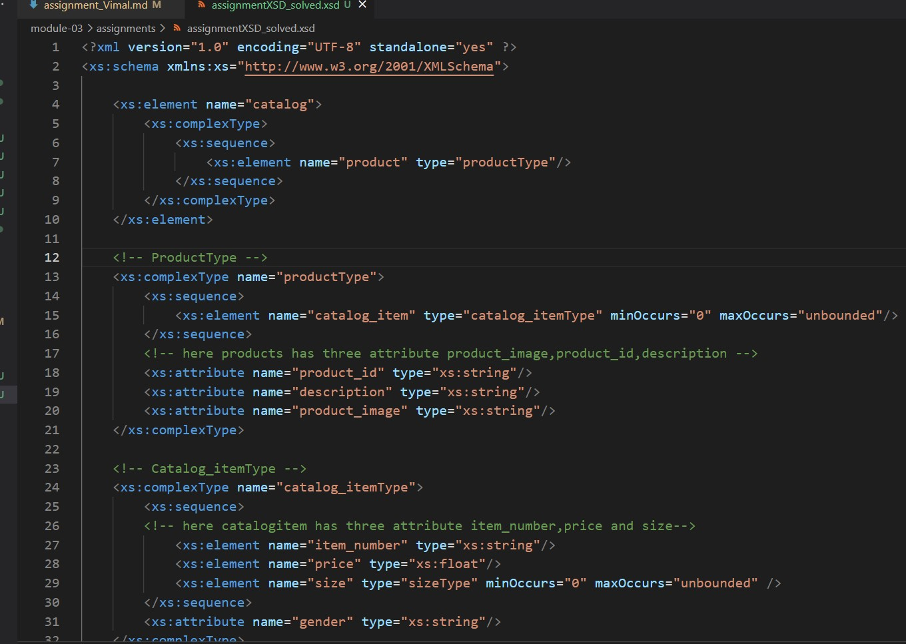

# Module-3 Assignment (Vimal Radadiya)
# Student_ID:n01546929

1. Open `module-3/assignments/assignment.xml` in your editor

2. Create DTD for this file and validate it using any of the tools we used
Ans: DTD is done in assignmentDTD_solved.xml
    
    
    
3. Create XSD for this file and validate it using any of the tools we used
Ans: XSD is done in assignmentXSD_solved.xsd
   
   

4. Explain your thought process for these 2 declarations
Ans:
--->In DTD declaration the task is to find out the root element along with other elements inside root element. After that, we have to define attribute and structure of element and type of element. And at last just validation of file using some online tools.

--->The relationship between an element and an attribute in xml document like specifying sequence, as well as complex types and groups of elements, must  be defined in XSD.After that we have add some constraints with data type 
At last we have to do validation of XSD with XML using tool to make sure of errors not occur

--->As per my thought proces, XSD is easire and better then DTD because XSD is more specific and easy to write.