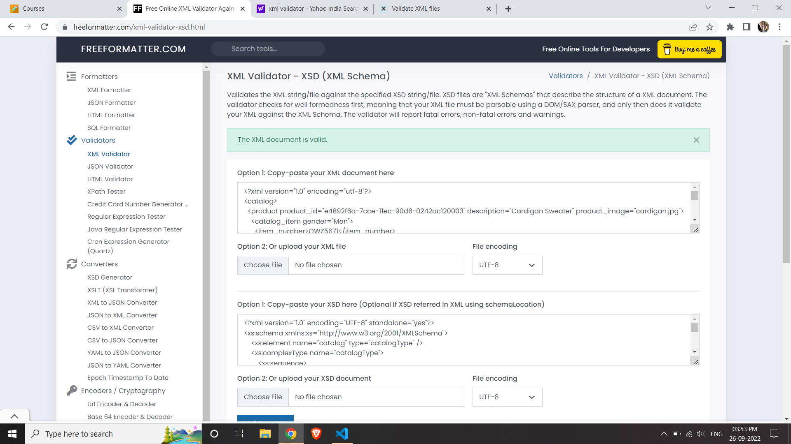

# Assignment

1. Open `module-3/assignments/assignment.xml` in your editor
2. Create DTD for this file and validate it using any of the tools we used

    

3. Create XSD for this file and validate it using any of the tools we used

    XSD is validated and no issues found
    

4. Explain your thought process for these 2 declarations

    DTD - While defining Document type definition we have to go through each element and define each element of the xml with valid DTD tag.
          we have to follow the specified format to define dtd.

    XSD - XML Schema Definition is simple way to define the xml document which is understandable and can be created easyly which just looks like xml with definition to the actual xml file.

    Creation of xsd is easy and understandable compared to adding DTD to xml file.

Create `module-3/assignments/assignment_YOURNAME.md` and add your theory answers. Add screenshots of each step to the file.
