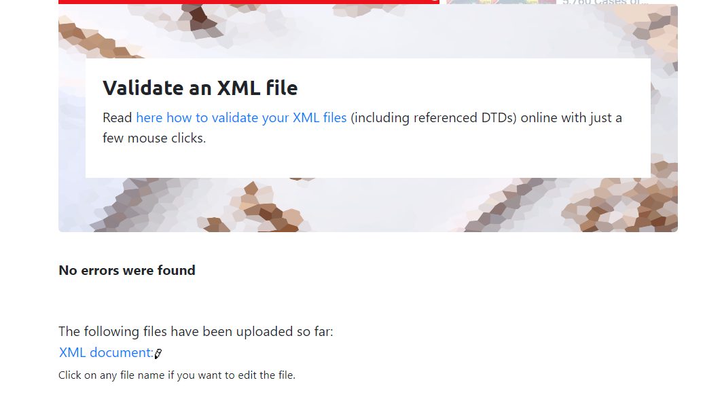
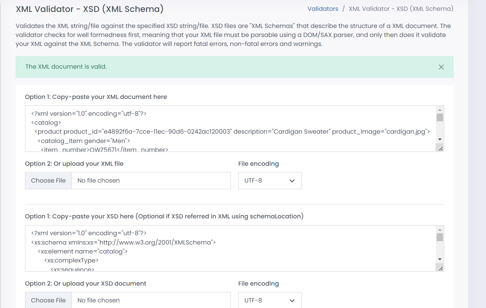

# Assignment

1. Open `module-3/assignments/assignment.xml` in your editor

2. Create DTD for this file and validate it using any of the tools we used

3. Create XSD for this file and validate it using any of the tools we used

4. Explain your thought process for these 2 declarations
Ans : 
--For DTD, DOCTYPE defines the root element and therefore here root elemet is catalog. thereafter, product is child of catalog and it occurs once and inside that element catalog_items occurs more than once and + sign denotes at least once.Here, as shown catalog_items has three attributes denoted by "ATTLIST" followed by element name and then the attribute name product_id, description and product_image. and type CDATA (character data) for image and description and ID for product_id.Further,catalog_item has item_number, price and size child element and it has attribute named gender and is distinguised as male and female. item_number and size is no further divided but size has inner elemet called color_swatch and + sign denotes at least once.color_swatch has atttribute called image with type CDATA(character data).

--For XSD, we are gonna use namespace xs and the URI given inside the syntax. Now, define the catalog element first. It is complexType because it has attributes and other element. child element of catalog is product and given type is productType because it is further divided so for that we will again use complexType and sequence with namespace.catalog has three attribute so it is denoted as shown in the code and name and type is string for all three. Now, product is further divided in catalog_item and put it in sequence because it occurs more than once so for that we use minOccurs and maxOccurs and set the value as per requirement.As we are in the complexType of catalog_item we will add attribute gender in this scope and given type is string as it is men and women. Furthermore, its sub element are item_number, price and size but size occurse more than once so it is further subdivided into color_swatch which also occurs more than once so minOccurs and maxOccurs is mentioned. As this is not further divided so set base type for color_swatch as string.Lastly, description attribute should be mentioned because we are still in the scope of size element.

Create `module-3/assignments/assignment_YOURNAME.md` and add your theory answers. Add screenshots of each step to the file.